NCAA Scoring Prediction Project
================
Jay Jang, Jason Qiu

# 1. LOAD DATA

``` r
data <- read_csv("data/CollegeBasketballPlayers2022.csv")
```

    ## New names:
    ## Rows: 3978 Columns: 66
    ## ── Column specification
    ## ──────────────────────────────────────────────────────── Delimiter: "," chr
    ## (8): player_name, team, conf, yr, ht, num, type, ...65 dbl (57): GP, Min_per,
    ## Ortg, usg, eFG, TS_per, ORB_per, DRB_per, AST_per, TO... lgl (1): pick
    ## ℹ Use `spec()` to retrieve the full column specification for this data. ℹ
    ## Specify the column types or set `show_col_types = FALSE` to quiet this message.
    ## • `` -> `...65`
    ## • `` -> `...66`

# 2. CLEANING FOR ORIGINAL MODEL

``` r
data_clean <- data %>%
  dplyr::select(pts, yr, Min_per, ORB_per, AST_per, TO_per,
         twoP_per, drtg, TP_per, dbpm) %>%
  filter(!is.na(yr), !is.na(pts)) %>%
  drop_na() %>%
  filter(
    between(ORB_per, 0, 100),
    between(AST_per, 0, 100),
    between(TO_per, 0, 100),
    between(twoP_per, 0, 100),
    between(TP_per, 0, 100)
  ) %>%
  filter(
    pts >= 0,
    Min_per >= 0,
    drtg >= 0, drtg < 200,
    dbpm < 100
  )

data_clean$yr <- factor(data_clean$yr, levels = c("So", "Jr", "Sr"))
```

# 3. FIT ORIGINAL MODEL

``` r
model <- lm(
  pts ~ yr + Min_per + ORB_per + AST_per + TO_per +
    twoP_per + drtg + TP_per + dbpm + yr:Min_per,
  data = data_clean
)

summary(model)
```

    ## 
    ## Call:
    ## lm(formula = pts ~ yr + Min_per + ORB_per + AST_per + TO_per + 
    ##     twoP_per + drtg + TP_per + dbpm + yr:Min_per, data = data_clean)
    ## 
    ## Residuals:
    ##     Min      1Q  Median      3Q     Max 
    ## -6.6113 -1.2907 -0.2700  0.8684 19.0738 
    ## 
    ## Coefficients:
    ##               Estimate Std. Error t value Pr(>|t|)    
    ## (Intercept)   3.190977   0.655034   4.871 1.15e-06 ***
    ## yrJr         -0.141208   0.153163  -0.922   0.3566    
    ## yrSr          0.149023   0.149898   0.994   0.3202    
    ## Min_per       0.121237   0.003317  36.547  < 2e-16 ***
    ## ORB_per       0.018071   0.007040   2.567   0.0103 *  
    ## AST_per       0.032393   0.004488   7.217 6.39e-13 ***
    ## TO_per       -0.019033   0.003082  -6.176 7.26e-10 ***
    ## twoP_per      1.333798   0.197962   6.738 1.85e-11 ***
    ## drtg         -0.033351   0.006297  -5.296 1.25e-07 ***
    ## TP_per        1.435901   0.221681   6.477 1.05e-10 ***
    ## dbpm         -0.138354   0.014721  -9.399  < 2e-16 ***
    ## yrJr:Min_per  0.016485   0.004050   4.070 4.79e-05 ***
    ## yrSr:Min_per  0.021153   0.003757   5.630 1.93e-08 ***
    ## ---
    ## Signif. codes:  0 '***' 0.001 '**' 0.01 '*' 0.05 '.' 0.1 ' ' 1
    ## 
    ## Residual standard error: 2.284 on 3768 degrees of freedom
    ## Multiple R-squared:  0.7672, Adjusted R-squared:  0.7664 
    ## F-statistic:  1035 on 12 and 3768 DF,  p-value: < 2.2e-16

# 4. ORIGINAL MODEL DIAGNOSTICS

``` r
e_hat <- residuals(model)
y_hat <- fitted(model)

par(mfrow = c(1,3))

plot(y_hat, data_clean$pts,
     xlab = "Fitted Values",
     ylab = "Points per Game",
     main = "Fitted vs Response")

plot(y_hat, e_hat,
     xlab = "Fitted Values",
     ylab = "Residuals",
     main = "Residuals vs Fitted")
abline(h=0)

qqnorm(e_hat, main="Normal Q-Q Plot")
qqline(e_hat)
```

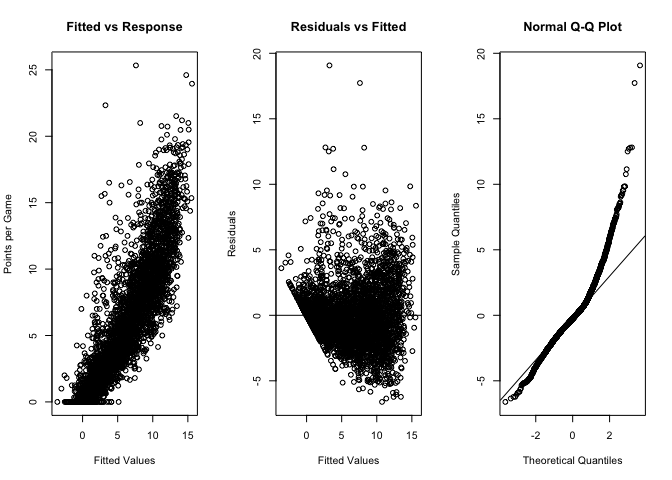<!-- -->

``` r
par(mfrow=c(1,1))
```

# 5. HISTOGRAMS & DESCRIPTIVE GRAPHS

``` r
ggplot(data_clean, aes(x = pts)) +
  geom_histogram(
    aes(fill = after_stat(ifelse(xmin == min(xmin), "first", "other"))),
    color = "black",
    bins = 80
  ) +
  scale_fill_manual(values = c("first" = "red", "other" = "grey70")) +
  labs(
    title = "Original Distribution of Points per Game (pts)",
    x = "Points per Game (pts)",
    y = "Count"
  ) +
  theme_bw() +
  theme(
    legend.position = "none",
    plot.title = element_text(face = "bold", hjust = 0.5)
  )
```

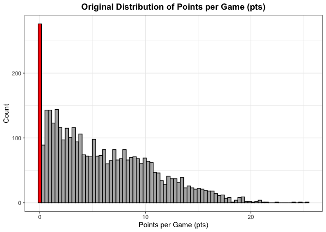<!-- -->

``` r
n_obs <- nrow(data_clean)

p1 <- ggplot(data_clean, aes(x = yr)) +
  geom_bar(fill = "grey70", color = "black") +
  labs(title = "Year (yr)") +
  theme_bw()

p2 <- ggplot(data_clean, aes(x = Min_per)) +
  geom_histogram(fill="grey70", color="black", bins=30) +
  labs(title="Minutes Played")

p3 <- ggplot(data_clean, aes(x = ORB_per)) +
  geom_histogram(fill="grey70", color="black", bins=30)

p4 <- ggplot(data_clean, aes(x = AST_per)) +
  geom_histogram(fill="grey70", color="black", bins=30)

p5 <- ggplot(data_clean, aes(x = TO_per)) +
  geom_histogram(fill="grey70", color="black", bins=30)

p6 <- ggplot(data_clean, aes(x = twoP_per)) +
  geom_histogram(fill="grey70", color="black", bins=30)

p7 <- ggplot(data_clean, aes(x = TP_per)) +
  geom_histogram(fill="grey70", color="black", bins=30)

p8 <- ggplot(data_clean, aes(x = drtg)) +
  geom_histogram(fill="grey70", color="black", bins=30)

p9 <- ggplot(data_clean, aes(x = dbpm)) +
  geom_histogram(fill="grey70", color="black", bins=30)

(p1 | p2 | p3) /
  (p4 | p5 | p6) /
  (p7 | p8 | p9)
```

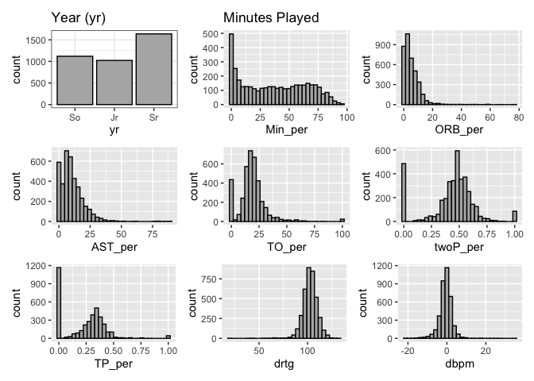<!-- -->

``` r
# Histogram of Min_per (Minutes Percentage) with vertical line at 5
ggplot(data_clean, aes(x = Min_per)) +
  geom_histogram(fill = "grey70", color = "black", bins = 30) +
  geom_vline(xintercept = 5, color = "red", linewidth = 1) +
  labs(
    title = "Histogram of Original Minutes Percentage (Min_per)",
    x = "Minutes Percentage (Min_per)",
    y = "Count"
  ) +
  theme_bw() +
  theme(
    plot.title = element_text(face = "bold", hjust = 0.5)
  )
```

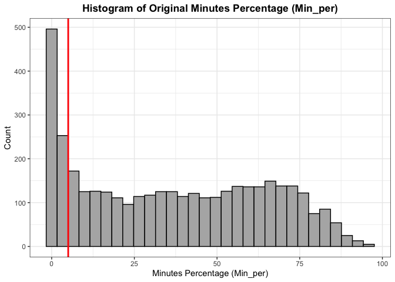<!-- -->

# 6. INTERACTION PLOT

``` r
ggplot(data_clean, aes(x = Min_per, y = pts, color = yr)) +
  geom_smooth(method="lm", se=FALSE, linewidth=1.2)
```

    ## `geom_smooth()` using formula = 'y ~ x'

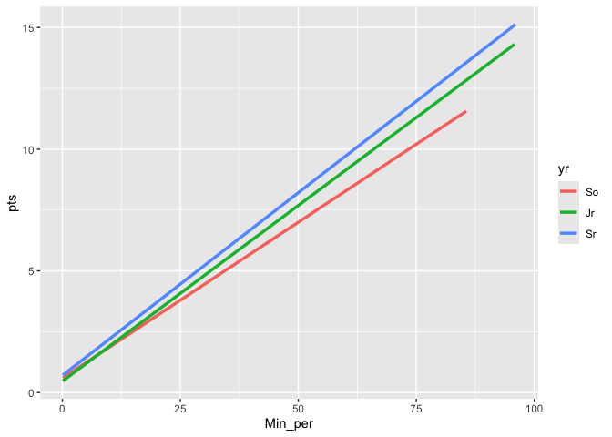<!-- -->

# 7. CORRELATION MATRIX FOR ORIGINAL MODEL

``` r
numeric_predictors <- data_clean %>%
  dplyr::select(Min_per, ORB_per, AST_per, TO_per,
         twoP_per, drtg, TP_per, dbpm)

cor_matrix <- cor(numeric_predictors, use="pairwise.complete.obs")

corrplot(
  cor_matrix,
  method="color",
  type="upper",
  order="hclust",
  tl.col="black",
  tl.cex=0.8,
  addCoef.col=NA,
  title="Correlation Matrix of Original Model Predictors",
  mar=c(0,0,2,0)
)
```

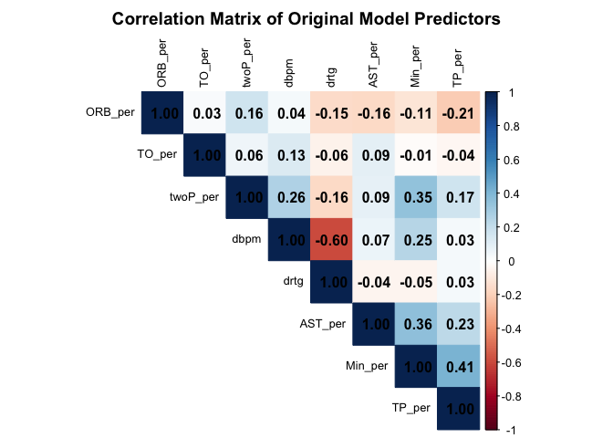<!-- -->

# 8. CLEAN DATA FOR BOX-COX MODEL

``` r
data_clean2 <- data %>%
  dplyr::select(
    pts, yr, Min_per,
    treb,
    AST_per, TO_per,
    TS_per,
    dbpm
  ) %>%
  filter(!is.na(yr), !is.na(pts)) %>%
  drop_na() %>%
  filter(
    between(treb, 0, 100),
    between(AST_per, 0, 100),
    between(TO_per, 0, 100),
    between(TS_per, 0, 100)
  ) %>%
  filter(
    pts > 0,
    Min_per > 5,
    dbpm < 100
  ) %>%
  mutate(
    yr = factor(yr, levels = c("So", "Jr", "Sr"))
  )
```

# 9. FIT NON-TRANSFORMED MODEL 2

``` r
model_final <- lm(
  pts ~ yr + Min_per + treb + AST_per + TO_per +
    TS_per + dbpm + yr:Min_per,
  data = data_clean2
)

summary(model_final)
```

    ## 
    ## Call:
    ## lm(formula = pts ~ yr + Min_per + treb + AST_per + TO_per + TS_per + 
    ##     dbpm + yr:Min_per, data = data_clean2)
    ## 
    ## Residuals:
    ##    Min     1Q Median     3Q    Max 
    ## -6.595 -1.331 -0.171  1.083 14.339 
    ## 
    ## Coefficients:
    ##               Estimate Std. Error t value Pr(>|t|)    
    ## (Intercept)  -2.891964   0.311097  -9.296  < 2e-16 ***
    ## yrJr         -0.437746   0.214440  -2.041 0.041304 *  
    ## yrSr         -0.253171   0.197437  -1.282 0.199839    
    ## Min_per       0.068936   0.004074  16.921  < 2e-16 ***
    ## treb          0.786769   0.027618  28.488  < 2e-16 ***
    ## AST_per       0.131217   0.006112  21.470  < 2e-16 ***
    ## TO_per       -0.085039   0.005932 -14.335  < 2e-16 ***
    ## TS_per        0.076445   0.004788  15.966  < 2e-16 ***
    ## dbpm         -0.409585   0.018288 -22.396  < 2e-16 ***
    ## yrJr:Min_per  0.017937   0.004859   3.691 0.000227 ***
    ## yrSr:Min_per  0.020622   0.004405   4.682 2.97e-06 ***
    ## ---
    ## Signif. codes:  0 '***' 0.001 '**' 0.01 '*' 0.05 '.' 0.1 ' ' 1
    ## 
    ## Residual standard error: 2.077 on 3011 degrees of freedom
    ## Multiple R-squared:  0.7808, Adjusted R-squared:  0.7801 
    ## F-statistic:  1073 on 10 and 3011 DF,  p-value: < 2.2e-16

# 10. BOX-COX TRANSFORMATION

``` r
model_initial <- lm(
  pts ~ yr + Min_per + treb + AST_per + TO_per +
    TS_per + dbpm + yr:Min_per,
  data = data_clean2
)

bc <- boxcox(model_initial, lambda = seq(-2, 2, 0.1))
```

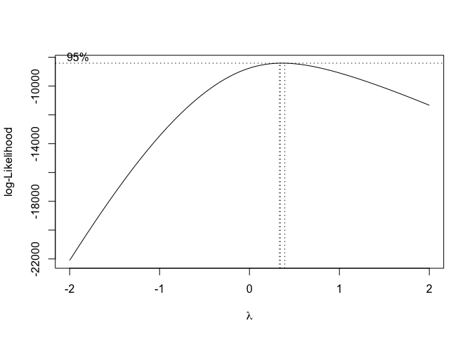<!-- -->

``` r
lambda <- bc$x[which.max(bc$y)]

data_clean2$bc_pts <- (data_clean2$pts^lambda - 1) / lambda
```

# 11. FIT BOX-COX MODEL

``` r
model_bc <- lm(
  bc_pts ~ yr + Min_per + treb + AST_per + TO_per +
    TS_per + dbpm + yr:Min_per,
  data = data_clean2
)

summary(model_bc)
```

    ## 
    ## Call:
    ## lm(formula = bc_pts ~ yr + Min_per + treb + AST_per + TO_per + 
    ##     TS_per + dbpm + yr:Min_per, data = data_clean2)
    ## 
    ## Residuals:
    ##      Min       1Q   Median       3Q      Max 
    ## -1.93967 -0.33874 -0.01063  0.33106  2.75960 
    ## 
    ## Coefficients:
    ##               Estimate Std. Error t value Pr(>|t|)    
    ## (Intercept)  -0.927224   0.079873 -11.609  < 2e-16 ***
    ## yrJr          0.121290   0.055057   2.203   0.0277 *  
    ## yrSr          0.313942   0.050691   6.193 6.70e-10 ***
    ## Min_per       0.029828   0.001046  28.516  < 2e-16 ***
    ## treb          0.217693   0.007091  30.701  < 2e-16 ***
    ## AST_per       0.034750   0.001569  22.146  < 2e-16 ***
    ## TO_per       -0.029815   0.001523 -19.576  < 2e-16 ***
    ## TS_per        0.029379   0.001229  23.899  < 2e-16 ***
    ## dbpm         -0.110766   0.004695 -23.590  < 2e-16 ***
    ## yrJr:Min_per -0.002389   0.001248  -1.915   0.0556 .  
    ## yrSr:Min_per -0.004635   0.001131  -4.098 4.27e-05 ***
    ## ---
    ## Signif. codes:  0 '***' 0.001 '**' 0.01 '*' 0.05 '.' 0.1 ' ' 1
    ## 
    ## Residual standard error: 0.5332 on 3011 degrees of freedom
    ## Multiple R-squared:  0.8344, Adjusted R-squared:  0.8338 
    ## F-statistic:  1517 on 10 and 3011 DF,  p-value: < 2.2e-16

# 12. BOX-COX DIAGNOSTICS

``` r
# Residuals and fitted values from final BC model
e_hat_final <- residuals(model_bc)
y_hat_final <- fitted(model_bc)

# Layout for 3 diagnostic plots
par(mfrow = c(1, 3))

# 1. Fitted vs Actual
plot(
  y_hat_final, data_clean2$bc_pts,
  xlab = "Fitted Values (BC-transformed scale)",
  ylab = "Observed Points per Game",
  main = "Final Model: Fitted vs Actual"
)

# 2. Residuals vs Fitted
plot(
  y_hat_final, e_hat_final,
  xlab = "Fitted Values (BC-transformed scale)",
  ylab = "Residuals",
  main = "Final Model: Residuals vs Fitted"
)
abline(h = 0)

# 3. QQ Plot
qqnorm(e_hat_final, main = "Final Model: Normal Q-Q Plot")
qqline(e_hat_final)
```

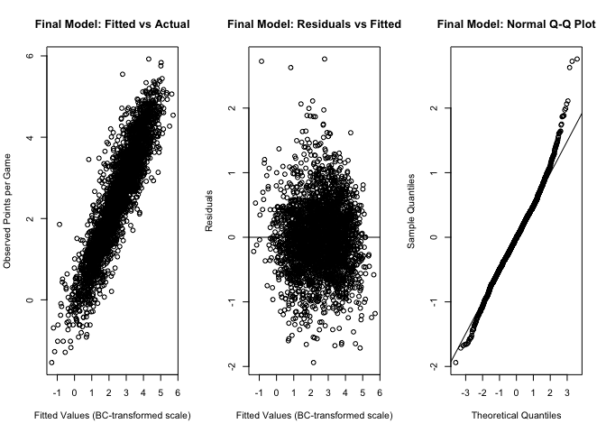<!-- -->

``` r
# Reset layout
par(mfrow = c(1, 1))
```

# 13. PARTIAL F TESTS

``` r
model_full <- model_bc

model_no_AST <- update(model_full, . ~ . - AST_per)
anova(model_no_AST, model_full)
```

    ## Analysis of Variance Table
    ## 
    ## Model 1: bc_pts ~ yr + Min_per + treb + TO_per + TS_per + dbpm + yr:Min_per
    ## Model 2: bc_pts ~ yr + Min_per + treb + AST_per + TO_per + TS_per + dbpm + 
    ##     yr:Min_per
    ##   Res.Df    RSS Df Sum of Sq      F    Pr(>F)    
    ## 1   3012 995.47                                  
    ## 2   3011 856.04  1    139.43 490.44 < 2.2e-16 ***
    ## ---
    ## Signif. codes:  0 '***' 0.001 '**' 0.01 '*' 0.05 '.' 0.1 ' ' 1

``` r
model_no_TO <- update(model_full, . ~ . - TO_per)
anova(model_no_TO, model_full)
```

    ## Analysis of Variance Table
    ## 
    ## Model 1: bc_pts ~ yr + Min_per + treb + AST_per + TS_per + dbpm + yr:Min_per
    ## Model 2: bc_pts ~ yr + Min_per + treb + AST_per + TO_per + TS_per + dbpm + 
    ##     yr:Min_per
    ##   Res.Df    RSS Df Sum of Sq     F    Pr(>F)    
    ## 1   3012 964.99                                 
    ## 2   3011 856.04  1    108.95 383.2 < 2.2e-16 ***
    ## ---
    ## Signif. codes:  0 '***' 0.001 '**' 0.01 '*' 0.05 '.' 0.1 ' ' 1

``` r
model_no_TS <- update(model_full, . ~ . - TS_per)
anova(model_no_TS, model_full)
```

    ## Analysis of Variance Table
    ## 
    ## Model 1: bc_pts ~ yr + Min_per + treb + AST_per + TO_per + dbpm + yr:Min_per
    ## Model 2: bc_pts ~ yr + Min_per + treb + AST_per + TO_per + TS_per + dbpm + 
    ##     yr:Min_per
    ##   Res.Df     RSS Df Sum of Sq      F    Pr(>F)    
    ## 1   3012 1018.43                                  
    ## 2   3011  856.04  1    162.39 571.17 < 2.2e-16 ***
    ## ---
    ## Signif. codes:  0 '***' 0.001 '**' 0.01 '*' 0.05 '.' 0.1 ' ' 1

``` r
model_no_interaction <- update(model_full, . ~ . - yr:Min_per)
anova(model_no_interaction, model_full)
```

    ## Analysis of Variance Table
    ## 
    ## Model 1: bc_pts ~ yr + Min_per + treb + AST_per + TO_per + TS_per + dbpm
    ## Model 2: bc_pts ~ yr + Min_per + treb + AST_per + TO_per + TS_per + dbpm + 
    ##     yr:Min_per
    ##   Res.Df    RSS Df Sum of Sq      F    Pr(>F)    
    ## 1   3013 861.05                                  
    ## 2   3011 856.04  2    5.0127 8.8157 0.0001523 ***
    ## ---
    ## Signif. codes:  0 '***' 0.001 '**' 0.01 '*' 0.05 '.' 0.1 ' ' 1

``` r
model_no_skills <- lm(
  bc_pts ~ yr + Min_per + dbpm + yr:Min_per,
  data = data_clean2
)
anova(model_no_skills, model_full)
```

    ## Analysis of Variance Table
    ## 
    ## Model 1: bc_pts ~ yr + Min_per + dbpm + yr:Min_per
    ## Model 2: bc_pts ~ yr + Min_per + treb + AST_per + TO_per + TS_per + dbpm + 
    ##     yr:Min_per
    ##   Res.Df     RSS Df Sum of Sq      F    Pr(>F)    
    ## 1   3015 1478.75                                  
    ## 2   3011  856.04  4    622.71 547.57 < 2.2e-16 ***
    ## ---
    ## Signif. codes:  0 '***' 0.001 '**' 0.01 '*' 0.05 '.' 0.1 ' ' 1

``` r
model_min_only <- lm(
  bc_pts ~ Min_per + yr:Min_per,
  data = data_clean2
)
anova(model_min_only, model_full)
```

    ## Analysis of Variance Table
    ## 
    ## Model 1: bc_pts ~ Min_per + yr:Min_per
    ## Model 2: bc_pts ~ yr + Min_per + treb + AST_per + TO_per + TS_per + dbpm + 
    ##     yr:Min_per
    ##   Res.Df     RSS Df Sum of Sq      F    Pr(>F)    
    ## 1   3018 1546.96                                  
    ## 2   3011  856.04  7    690.92 347.18 < 2.2e-16 ***
    ## ---
    ## Signif. codes:  0 '***' 0.001 '**' 0.01 '*' 0.05 '.' 0.1 ' ' 1

# 14. INFLUENCE DIAGNOSTICS

``` r
lev <- hatvalues(model_bc)
rstd <- rstandard(model_bc)
cd <- cooks.distance(model_bc)
dff <- dffits(model_bc)
dfb <- dfbetas(model_bc)

p <- length(coef(model_bc)) - 1
n <- nrow(data_clean2)

cut_lev <- 2*(p+1)/n
cut_r <- 4
cut_cd <- qf(0.5, p+1, n-p-1)
cut_dff <- 2*sqrt((p+1)/n)
cut_dfb <- 2/sqrt(n)

which(lev > cut_lev)
```

    ##   58   97  104  233  315  349  385  388  396  433  578  582  594  609  612  625 
    ##   58   97  104  233  315  349  385  388  396  433  578  582  594  609  612  625 
    ##  627  678  698  724  732  736  763  780  786  803  872  882  887  900  943  975 
    ##  627  678  698  724  732  736  763  780  786  803  872  882  887  900  943  975 
    ##  999 1023 1035 1048 1070 1096 1132 1151 1165 1203 1228 1230 1231 1238 1276 1283 
    ##  999 1023 1035 1048 1070 1096 1132 1151 1165 1203 1228 1230 1231 1238 1276 1283 
    ## 1318 1343 1354 1362 1370 1406 1407 1411 1459 1460 1463 1480 1483 1509 1517 1539 
    ## 1318 1343 1354 1362 1370 1406 1407 1411 1459 1460 1463 1480 1483 1509 1517 1539 
    ## 1551 1554 1569 1578 1580 1616 1621 1649 1712 1723 1739 1745 1788 1809 1820 1822 
    ## 1551 1554 1569 1578 1580 1616 1621 1649 1712 1723 1739 1745 1788 1809 1820 1822 
    ## 1825 1862 1891 1896 1948 1982 1992 2000 2008 2015 2021 2024 2030 2043 2045 2069 
    ## 1825 1862 1891 1896 1948 1982 1992 2000 2008 2015 2021 2024 2030 2043 2045 2069 
    ## 2073 2089 2097 2101 2138 2175 2176 2184 2185 2193 2204 2208 2223 2268 2272 2273 
    ## 2073 2089 2097 2101 2138 2175 2176 2184 2185 2193 2204 2208 2223 2268 2272 2273 
    ## 2277 2280 2289 2290 2298 2302 2305 2309 2317 2327 2328 2341 2346 2350 2356 2366 
    ## 2277 2280 2289 2290 2298 2302 2305 2309 2317 2327 2328 2341 2346 2350 2356 2366 
    ## 2376 2407 2438 2451 2477 2506 2507 2514 2526 2533 2534 2537 2545 2546 2550 2565 
    ## 2376 2407 2438 2451 2477 2506 2507 2514 2526 2533 2534 2537 2545 2546 2550 2565 
    ## 2567 2576 2581 2600 2605 2609 2610 2614 2627 2638 2643 2644 2651 2659 2664 2665 
    ## 2567 2576 2581 2600 2605 2609 2610 2614 2627 2638 2643 2644 2651 2659 2664 2665 
    ## 2678 2721 2724 2733 2739 2740 2746 2747 2761 2763 2784 2786 2795 2815 2816 2827 
    ## 2678 2721 2724 2733 2739 2740 2746 2747 2761 2763 2784 2786 2795 2815 2816 2827 
    ## 2853 2860 2863 2864 2877 2896 2904 2924 2928 2947 2952 2954 2959 2961 2971 2978 
    ## 2853 2860 2863 2864 2877 2896 2904 2924 2928 2947 2952 2954 2959 2961 2971 2978 
    ## 2991 3003 3007 3012 3017 3018 3020 
    ## 2991 3003 3007 3012 3017 3018 3020

``` r
which(abs(rstd) > cut_r)
```

    ##  803 1630 3007 
    ##  803 1630 3007

``` r
which(cd > cut_cd)
```

    ## named integer(0)

``` r
which(abs(dff) > cut_dff)
```

    ##   27   47   58   97  104  111  161  178  233  296  315  333  354  385  388  409 
    ##   27   47   58   97  104  111  161  178  233  296  315  333  354  385  388  409 
    ##  433  450  455  508  518  520  562  579  587  594  605  626  636  638  698  712 
    ##  433  450  455  508  518  520  562  579  587  594  605  626  636  638  698  712 
    ##  720  724  727  763  780  781  799  803  867  872  883  891  903  926  959  985 
    ##  720  724  727  763  780  781  799  803  867  872  883  891  903  926  959  985 
    ## 1000 1018 1023 1030 1036 1037 1038 1041 1056 1070 1096 1126 1165 1169 1181 1183 
    ## 1000 1018 1023 1030 1036 1037 1038 1041 1056 1070 1096 1126 1165 1169 1181 1183 
    ## 1193 1224 1225 1227 1228 1231 1238 1265 1276 1283 1285 1304 1325 1370 1376 1378 
    ## 1193 1224 1225 1227 1228 1231 1238 1265 1276 1283 1285 1304 1325 1370 1376 1378 
    ## 1384 1396 1423 1433 1459 1460 1463 1487 1509 1517 1539 1569 1572 1574 1580 1594 
    ## 1384 1396 1423 1433 1459 1460 1463 1487 1509 1517 1539 1569 1572 1574 1580 1594 
    ## 1630 1650 1666 1686 1712 1732 1739 1742 1781 1793 1820 1822 1835 1866 1886 1904 
    ## 1630 1650 1666 1686 1712 1732 1739 1742 1781 1793 1820 1822 1835 1866 1886 1904 
    ## 1918 1921 1935 2000 2008 2017 2039 2043 2076 2087 2101 2110 2116 2124 2131 2150 
    ## 1918 1921 1935 2000 2008 2017 2039 2043 2076 2087 2101 2110 2116 2124 2131 2150 
    ## 2160 2176 2207 2208 2277 2302 2304 2343 2371 2376 2390 2507 2519 2521 2534 2537 
    ## 2160 2176 2207 2208 2277 2302 2304 2343 2371 2376 2390 2507 2519 2521 2534 2537 
    ## 2545 2567 2576 2586 2588 2609 2619 2623 2638 2651 2665 2699 2707 2724 2729 2733 
    ## 2545 2567 2576 2586 2588 2609 2619 2623 2638 2651 2665 2699 2707 2724 2729 2733 
    ## 2739 2763 2765 2769 2774 2780 2805 2829 2833 2839 2863 2864 2877 2896 2902 2909 
    ## 2739 2763 2765 2769 2774 2780 2805 2829 2833 2839 2863 2864 2877 2896 2902 2909 
    ## 2928 2930 2938 2943 2944 2947 2952 2959 2972 2995 3003 3007 
    ## 2928 2930 2938 2943 2944 2947 2952 2959 2972 2995 3003 3007

``` r
apply(abs(dfb) > cut_dfb, 2, which)
```

    ## $`(Intercept)`
    ##   47   50   65  104  107  146  160  161  178  298  315  333  377  385  409  455 
    ##   47   50   65  104  107  146  160  161  178  298  315  333  377  385  409  455 
    ##  508  518  520  535  551  579  582  594  609  636  638  672  698  720  727  736 
    ##  508  518  520  535  551  579  582  594  609  636  638  672  698  720  727  736 
    ##  754  763  781  799  803  872  883  891  903  975  985 1000 1023 1036 1038 1048 
    ##  754  763  781  799  803  872  883  891  903  975  985 1000 1023 1036 1038 1048 
    ## 1070 1090 1096 1169 1183 1212 1231 1238 1283 1325 1350 1364 1370 1378 1400 1423 
    ## 1070 1090 1096 1169 1183 1212 1231 1238 1283 1325 1350 1364 1370 1378 1400 1423 
    ## 1431 1433 1459 1509 1539 1572 1594 1598 1621 1630 1659 1666 1700 1736 1739 1742 
    ## 1431 1433 1459 1509 1539 1572 1594 1598 1621 1630 1659 1666 1700 1736 1739 1742 
    ## 1788 1822 1835 1886 1912 1915 1921 2008 2017 2021 2030 2043 2049 2076 2101 2116 
    ## 1788 1822 1835 1886 1912 1915 1921 2008 2017 2021 2030 2043 2049 2076 2101 2116 
    ## 2141 2150 2160 2161 2198 2207 2208 2256 2268 2277 2281 2296 2302 2309 2341 2348 
    ## 2141 2150 2160 2161 2198 2207 2208 2256 2268 2277 2281 2296 2302 2309 2341 2348 
    ## 2350 2371 2376 2393 2396 2407 2430 2443 2445 2466 2474 2486 2492 2534 2537 2545 
    ## 2350 2371 2376 2393 2396 2407 2430 2443 2445 2466 2474 2486 2492 2534 2537 2545 
    ## 2567 2576 2589 2595 2609 2631 2664 2678 2679 2689 2699 2716 2724 2733 2734 2737 
    ## 2567 2576 2589 2595 2609 2631 2664 2678 2679 2689 2699 2716 2724 2733 2734 2737 
    ## 2743 2763 2792 2805 2829 2851 2863 2864 2877 2902 2909 2912 2938 2943 2944 2947 
    ## 2743 2763 2792 2805 2829 2851 2863 2864 2877 2902 2909 2912 2938 2943 2944 2947 
    ## 2950 2952 2959 2987 3007 3021 
    ## 2950 2952 2959 2987 3007 3021 
    ## 
    ## $yrJr
    ##  582  609  639  763  799  867  872  893  947  994  999 1023 1030 1046 1056 1070 
    ##  582  609  639  763  799  867  872  893  947  994  999 1023 1030 1046 1056 1070 
    ## 1186 1193 1203 1212 1283 1285 1297 1304 1318 1325 1357 1370 1371 1378 1384 1388 
    ## 1186 1193 1203 1212 1283 1285 1297 1304 1318 1325 1357 1370 1371 1378 1384 1388 
    ## 1389 1391 1396 1400 1403 1412 1423 1428 1432 1435 1460 1487 1503 1509 1517 1520 
    ## 1389 1391 1396 1400 1403 1412 1423 1428 1432 1435 1460 1487 1503 1509 1517 1520 
    ## 1551 1569 1574 1594 1601 1621 1630 1640 1650 1659 1660 1686 1695 1729 1739 1750 
    ## 1551 1569 1574 1594 1601 1621 1630 1640 1650 1659 1660 1686 1695 1729 1739 1750 
    ## 1752 1781 1785 1788 1793 1800 1806 1811 1819 1820 1835 1866 1886 1896 1912 1917 
    ## 1752 1781 1785 1788 1793 1800 1806 1811 1819 1820 1835 1866 1886 1896 1912 1917 
    ## 1918 1921 1969 1977 1982 1994 2000 2008 2017 2022 2038 2039 2043 2049 2050 2060 
    ## 1918 1921 1969 1977 1982 1994 2000 2008 2017 2022 2038 2039 2043 2049 2050 2060 
    ## 2061 2076 2087 2101 2110 2116 2124 2141 2152 2161 2176 2198 2207 2208 2215 2228 
    ## 2061 2076 2087 2101 2110 2116 2124 2141 2152 2161 2176 2198 2207 2208 2215 2228 
    ## 2233 2250 2268 2277 2281 2317 2325 2341 2343 2374 2376 2390 2396 2430 2436 2443 
    ## 2233 2250 2268 2277 2281 2317 2325 2341 2343 2374 2376 2390 2396 2430 2436 2443 
    ## 2445 2481 2492 2496 2507 2519 2533 2534 2537 2545 2567 2571 2576 2585 2586 2588 
    ## 2445 2481 2492 2496 2507 2519 2533 2534 2537 2545 2567 2571 2576 2585 2586 2588 
    ## 2623 2630 2633 2638 2651 2678 2679 2685 2724 2733 2734 2761 2763 2765 2774 2776 
    ## 2623 2630 2633 2638 2651 2678 2679 2685 2724 2733 2734 2761 2763 2765 2774 2776 
    ## 2783 2786 2805 2855 2863 2864 2896 2902 2906 2909 2917 2930 2938 2943 2949 2952 
    ## 2783 2786 2805 2855 2863 2864 2896 2902 2906 2909 2917 2930 2938 2943 2949 2952 
    ## 2972 2987 2995 3021 
    ## 2972 2987 2995 3021 
    ## 
    ## $yrSr
    ##    7   17   22   27   40   41   52   57   58   67   71  104  111  161  178  213 
    ##    7   17   22   27   40   41   52   57   58   67   71  104  111  161  178  213 
    ##  232  233  256  296  298  333  360  379  385  396  433  455  456  469  476  489 
    ##  232  233  256  296  298  333  360  379  385  396  433  455  456  469  476  489 
    ##  508  520  547  558  562  579  587  594  605  626  636  638  672  687  698  702 
    ##  508  520  547  558  562  579  587  594  605  626  636  638  672  687  698  702 
    ##  720  742  754  781  803  819  849  872  880  883  891  892  903  926  959  964 
    ##  720  742  754  781  803  819  849  872  880  883  891  892  903  926  959  964 
    ##  975  985 1000 1018 1037 1038 1041 1090 1096 1118 1132 1137 1149 1165 1181 1209 
    ##  975  985 1000 1018 1037 1038 1041 1090 1096 1118 1132 1137 1149 1165 1181 1209 
    ## 1224 1225 1226 1227 1231 1238 1264 1265 1364 1382 1463 1551 1572 1742 1752 1778 
    ## 1224 1225 1226 1227 1231 1238 1264 1265 1364 1382 1463 1551 1572 1742 1752 1778 
    ## 1822 1862 1915 1921 1935 1941 2016 2030 2138 2160 2161 2176 2195 2198 2207 2208 
    ## 1822 1862 1915 1921 1935 1941 2016 2030 2138 2160 2161 2176 2195 2198 2207 2208 
    ## 2213 2215 2219 2228 2229 2233 2250 2256 2268 2277 2281 2286 2302 2309 2325 2343 
    ## 2213 2215 2219 2228 2229 2233 2250 2256 2268 2277 2281 2286 2302 2309 2325 2343 
    ## 2371 2374 2376 2388 2390 2393 2396 2430 2436 2443 2445 2481 2492 2495 2496 2507 
    ## 2371 2374 2376 2388 2390 2393 2396 2430 2436 2443 2445 2481 2492 2495 2496 2507 
    ## 2509 2519 2524 2533 2537 2567 2570 2571 2576 2585 2586 2588 2589 2595 2615 2623 
    ## 2509 2519 2524 2533 2537 2567 2570 2571 2576 2585 2586 2588 2589 2595 2615 2623 
    ## 2626 2630 2633 2638 2640 2642 2651 2678 2679 2685 2686 2699 2707 2729 2733 2734 
    ## 2626 2630 2633 2638 2640 2642 2651 2678 2679 2685 2686 2699 2707 2729 2733 2734 
    ## 2739 2761 2763 2765 2770 2774 2776 2783 2805 2831 2851 2863 2864 2877 2895 2896 
    ## 2739 2761 2763 2765 2770 2774 2776 2783 2805 2831 2851 2863 2864 2877 2895 2896 
    ## 2902 2906 2909 2917 2930 2938 2943 2947 2949 2952 2959 2972 2987 2995 3003 3007 
    ## 2902 2906 2909 2917 2930 2938 2943 2947 2949 2952 2959 2972 2987 2995 3003 3007 
    ## 3021 
    ## 3021 
    ## 
    ## $Min_per
    ##   27   58   97  178  233  315  333  354  433  508  605  698  780  799  803  867 
    ##   27   58   97  178  233  315  333  354  433  508  605  698  780  799  803  867 
    ##  872  891  903 1037 1165 1225 1276 1285 1384 1385 1427 1459 1509 1517 1539 1551 
    ##  872  891  903 1037 1165 1225 1276 1285 1384 1385 1427 1459 1509 1517 1539 1551 
    ## 1574 1580 1594 1666 1712 1741 1752 1799 1862 1921 2008 2017 2075 2101 2114 2127 
    ## 1574 1580 1594 1666 1712 1741 1752 1799 1862 1921 2008 2017 2075 2101 2114 2127 
    ## 2151 2153 2160 2161 2175 2176 2198 2201 2207 2208 2213 2215 2226 2228 2229 2233 
    ## 2151 2153 2160 2161 2175 2176 2198 2201 2207 2208 2213 2215 2226 2228 2229 2233 
    ## 2252 2257 2267 2272 2276 2277 2280 2286 2287 2309 2325 2336 2343 2366 2376 2390 
    ## 2252 2257 2267 2272 2276 2277 2280 2286 2287 2309 2325 2336 2343 2366 2376 2390 
    ## 2393 2430 2436 2442 2443 2451 2468 2484 2492 2496 2507 2519 2522 2533 2537 2567 
    ## 2393 2430 2436 2442 2443 2451 2468 2484 2492 2496 2507 2519 2522 2533 2537 2567 
    ## 2571 2576 2581 2585 2586 2588 2609 2612 2619 2626 2630 2633 2638 2651 2670 2678 
    ## 2571 2576 2581 2585 2586 2588 2609 2612 2619 2626 2630 2633 2638 2651 2670 2678 
    ## 2684 2685 2721 2733 2734 2747 2748 2759 2761 2763 2765 2774 2776 2780 2783 2805 
    ## 2684 2685 2721 2733 2734 2747 2748 2759 2761 2763 2765 2774 2776 2780 2783 2805 
    ## 2815 2827 2839 2841 2852 2858 2863 2864 2877 2881 2895 2896 2902 2906 2909 2917 
    ## 2815 2827 2839 2841 2852 2858 2863 2864 2877 2881 2895 2896 2902 2906 2909 2917 
    ## 2918 2923 2924 2928 2930 2932 2936 2938 2945 2949 2950 2952 2972 2982 2987 2991 
    ## 2918 2923 2924 2928 2930 2932 2936 2938 2945 2949 2950 2952 2972 2982 2987 2991 
    ## 2995 2999 3002 3007 3021 
    ## 2995 2999 3002 3007 3021 
    ## 
    ## $treb
    ##   17   27   47   52   57   58   83   97  111  160  178  187  208  226  233  242 
    ##   17   27   47   52   57   58   83   97  111  160  178  187  208  226  233  242 
    ##  253  266  277  283  307  315  333  349  350  351  354  378  385  388  396  421 
    ##  253  266  277  283  307  315  333  349  350  351  354  378  385  388  396  421 
    ##  431  432  433  435  441  455  461  488  490  505  508  541  546  562  563  605 
    ##  431  432  433  435  441  455  461  488  490  505  508  541  546  562  563  605 
    ##  614  631  637  638  643  698  703  712  724  726  764  780  799  803  867  872 
    ##  614  631  637  638  643  698  703  712  724  726  764  780  799  803  867  872 
    ##  883  887  891  903  926  939  955  985 1002 1004 1018 1037 1056 1104 1132 1160 
    ##  883  887  891  903  926  939  955  985 1002 1004 1018 1037 1056 1104 1132 1160 
    ## 1165 1169 1173 1177 1181 1183 1199 1206 1208 1224 1225 1227 1237 1238 1254 1269 
    ## 1165 1169 1173 1177 1181 1183 1199 1206 1208 1224 1225 1227 1237 1238 1254 1269 
    ## 1276 1285 1318 1324 1378 1384 1388 1396 1398 1419 1457 1459 1463 1480 1492 1496 
    ## 1276 1285 1318 1324 1378 1384 1388 1396 1398 1419 1457 1459 1463 1480 1492 1496 
    ## 1509 1517 1539 1540 1548 1566 1573 1574 1580 1594 1595 1666 1672 1704 1712 1728 
    ## 1509 1517 1539 1540 1548 1566 1573 1574 1580 1594 1595 1666 1672 1704 1712 1728 
    ## 1766 1771 1796 1835 1841 1854 1866 1879 1918 1927 1935 1948 1950 1987 2008 2017 
    ## 1766 1771 1796 1835 1841 1854 1866 1879 1918 1927 1935 1948 1950 1987 2008 2017 
    ## 2018 2021 2039 2064 2087 2101 2103 2128 2131 2141 2277 2317 2343 2371 2443 2461 
    ## 2018 2021 2039 2064 2087 2101 2103 2128 2131 2141 2277 2317 2343 2371 2443 2461 
    ## 2576 2586 2636 2651 2665 2707 2724 2739 2769 2833 2839 2870 2881 2909 2919 2924 
    ## 2576 2586 2636 2651 2665 2707 2724 2739 2769 2833 2839 2870 2881 2909 2919 2924 
    ## 2928 
    ## 2928 
    ## 
    ## $AST_per
    ##    8   23   27   40   47   57   58  123  126  161  178  187  200  227  233  235 
    ##    8   23   27   40   47   57   58  123  126  161  178  187  200  227  233  235 
    ##  256  257  283  296  315  333  350  356  362  369  372  385  433  455  456  460 
    ##  256  257  283  296  315  333  350  356  362  369  372  385  433  455  456  460 
    ##  508  518  545  547  562  577  594  605  625  636  647  678  687  698  703  726 
    ##  508  518  545  547  562  577  594  605  625  636  647  678  687  698  703  726 
    ##  727  740  747  766  780  781  799  803  824  860  867  883  891  903  959  965 
    ##  727  740  747  766  780  781  799  803  824  860  867  883  891  903  959  965 
    ##  973  985 1002 1018 1037 1038 1048 1056 1090 1096 1137 1181 1191 1193 1200 1208 
    ##  973  985 1002 1018 1037 1038 1048 1056 1090 1096 1137 1181 1191 1193 1200 1208 
    ## 1220 1227 1229 1256 1264 1265 1269 1298 1304 1305 1318 1323 1324 1325 1341 1376 
    ## 1220 1227 1229 1256 1264 1265 1269 1298 1304 1305 1318 1323 1324 1325 1341 1376 
    ## 1384 1423 1433 1459 1460 1487 1492 1509 1539 1540 1548 1572 1574 1589 1594 1650 
    ## 1384 1423 1433 1459 1460 1487 1492 1509 1539 1540 1548 1572 1574 1589 1594 1650 
    ## 1666 1686 1704 1712 1732 1742 1743 1800 1817 1820 1822 1849 1904 1921 1964 1992 
    ## 1666 1686 1704 1712 1732 1742 1743 1800 1817 1820 1822 1849 1904 1921 1964 1992 
    ## 2008 2017 2018 2087 2101 2160 2176 2195 2228 2277 2280 2304 2318 2336 2371 2388 
    ## 2008 2017 2018 2087 2101 2160 2176 2195 2228 2277 2280 2304 2318 2336 2371 2388 
    ## 2505 2507 2521 2534 2562 2576 2586 2627 2630 2638 2678 2733 2746 2760 2761 2765 
    ## 2505 2507 2521 2534 2562 2576 2586 2627 2630 2638 2678 2733 2746 2760 2761 2765 
    ## 2786 2805 2831 2839 2877 2896 2902 2917 2924 2947 2964 3003 3007 3008 
    ## 2786 2805 2831 2839 2877 2896 2902 2917 2924 2947 2964 3003 3007 3008 
    ## 
    ## $TO_per
    ##   47   58  104  178  226  233  271  296  298  333  367  379  385  415  423  433 
    ##   47   58  104  178  226  233  271  296  298  333  367  379  385  415  423  433 
    ##  441  518  520  549  551  562  587  594  605  609  627  636  638  687  689  720 
    ##  441  518  520  549  551  562  587  594  605  609  627  636  638  687  689  720 
    ##  763  766  781  803  819  867  893  926  975  999 1000 1030 1041 1051 1056 1070 
    ##  763  766  781  803  819  867  893  926  975  999 1000 1030 1041 1051 1056 1070 
    ## 1096 1137 1155 1165 1169 1181 1182 1193 1201 1208 1212 1224 1225 1229 1231 1254 
    ## 1096 1137 1155 1165 1169 1181 1182 1193 1201 1208 1212 1224 1225 1229 1231 1254 
    ## 1285 1297 1323 1325 1370 1378 1384 1390 1402 1423 1435 1460 1487 1509 1517 1520 
    ## 1285 1297 1323 1325 1370 1378 1384 1390 1402 1423 1435 1460 1487 1509 1517 1520 
    ## 1539 1551 1569 1594 1598 1599 1621 1666 1712 1736 1739 1778 1793 1809 1822 1835 
    ## 1539 1551 1569 1594 1598 1599 1621 1666 1712 1736 1739 1778 1793 1809 1822 1835 
    ## 1886 1896 1904 1935 1970 2030 2043 2048 2103 2110 2116 2124 2161 2208 2256 2290 
    ## 1886 1896 1904 1935 1970 2030 2043 2048 2103 2110 2116 2124 2161 2208 2256 2290 
    ## 2304 2309 2346 2371 2376 2388 2390 2396 2405 2436 2481 2507 2521 2522 2534 2537 
    ## 2304 2309 2346 2371 2376 2388 2390 2396 2405 2436 2481 2507 2521 2522 2534 2537 
    ## 2545 2585 2586 2595 2602 2623 2633 2638 2659 2661 2664 2670 2671 2689 2699 2707 
    ## 2545 2585 2586 2595 2602 2623 2633 2638 2659 2661 2664 2670 2671 2689 2699 2707 
    ## 2724 2729 2733 2734 2739 2763 2765 2775 2780 2805 2829 2851 2863 2864 2877 2902 
    ## 2724 2729 2733 2734 2739 2763 2765 2775 2780 2805 2829 2851 2863 2864 2877 2902 
    ## 2925 2943 2959 2961 2972 3003 3007 3012 3021 
    ## 2925 2943 2959 2961 2972 3003 3007 3012 3021 
    ## 
    ## $TS_per
    ##   47   50   57   58   61   65  104  107  117  146  160  161  178  199  215  233 
    ##   47   50   57   58   61   65  104  107  117  146  160  161  178  199  215  233 
    ##  257  298  315  333  377  385  396  409  433  450  455  488  489  508  562  575 
    ##  257  298  315  333  377  385  396  409  433  450  455  488  489  508  562  575 
    ##  579  582  587  598  609  626  627  636  638  672  698  727  736  778  781  799 
    ##  579  582  587  598  609  626  627  636  638  672  698  727  736  778  781  799 
    ##  803  849  883  892  903  926  964  970  975  985  989 1000 1018 1023 1030 1036 
    ##  803  849  883  892  903  926  964  970  975  985  989 1000 1018 1023 1030 1036 
    ## 1038 1046 1048 1070 1096 1156 1165 1183 1193 1209 1231 1238 1254 1259 1283 1298 
    ## 1038 1046 1048 1070 1096 1156 1165 1183 1193 1209 1231 1238 1254 1259 1283 1298 
    ## 1323 1325 1364 1370 1396 1400 1423 1431 1433 1459 1509 1517 1539 1569 1572 1594 
    ## 1323 1325 1364 1370 1396 1400 1423 1431 1433 1459 1509 1517 1539 1569 1572 1594 
    ## 1621 1630 1659 1666 1704 1732 1739 1742 1787 1788 1819 1822 1879 1905 1912 1915 
    ## 1621 1630 1659 1666 1704 1732 1739 1742 1787 1788 1819 1822 1879 1905 1912 1915 
    ## 2008 2021 2030 2039 2043 2049 2060 2076 2116 2131 2141 2150 2160 2198 2207 2208 
    ## 2008 2021 2030 2039 2043 2049 2060 2076 2116 2131 2141 2150 2160 2198 2207 2208 
    ## 2213 2228 2250 2251 2277 2279 2281 2302 2325 2341 2343 2350 2390 2507 2509 2519 
    ## 2213 2228 2250 2251 2277 2279 2281 2302 2325 2341 2343 2350 2390 2507 2509 2519 
    ## 2524 2534 2537 2545 2567 2585 2589 2601 2609 2614 2617 2631 2664 2678 2679 2685 
    ## 2524 2534 2537 2545 2567 2585 2589 2601 2609 2614 2617 2631 2664 2678 2679 2685 
    ## 2686 2689 2723 2724 2728 2733 2743 2756 2763 2765 2774 2829 2851 2864 2877 2896 
    ## 2686 2689 2723 2724 2728 2733 2743 2756 2763 2765 2774 2829 2851 2864 2877 2896 
    ## 2901 2902 2906 2930 2943 2944 2947 2959 2972 2987 3003 3007 3021 
    ## 2901 2902 2906 2930 2943 2944 2947 2959 2972 2987 3003 3007 3021 
    ## 
    ## $dbpm
    ##   10   23   47   53   74   95   99  153  161  178  213  233  333  354  362  369 
    ##   10   23   47   53   74   95   99  153  161  178  213  233  333  354  362  369 
    ##  385  388  393  409  432  450  463  477  488  508  560  562  587  592  609  636 
    ##  385  388  393  409  432  450  463  477  488  508  560  562  587  592  609  636 
    ##  658  682  685  687  698  707  712  724  732  742  754  781  803  823  849  867 
    ##  658  682  685  687  698  707  712  724  732  742  754  781  803  823  849  867 
    ##  872  880  887  891  892  899  903  955  964  965  989  999 1002 1018 1023 1030 
    ##  872  880  887  891  892  899  903  955  964  965  989  999 1002 1018 1023 1030 
    ## 1036 1038 1041 1069 1090 1096 1110 1128 1132 1133 1150 1155 1156 1165 1181 1199 
    ## 1036 1038 1041 1069 1090 1096 1110 1128 1132 1133 1150 1155 1156 1165 1181 1199 
    ## 1201 1203 1212 1224 1225 1228 1265 1282 1304 1357 1378 1384 1388 1390 1391 1396 
    ## 1201 1203 1212 1224 1225 1228 1265 1282 1304 1357 1378 1384 1388 1390 1391 1396 
    ## 1433 1437 1463 1470 1472 1496 1509 1517 1536 1539 1551 1574 1580 1586 1594 1666 
    ## 1433 1437 1463 1470 1472 1496 1509 1517 1536 1539 1551 1574 1580 1586 1594 1666 
    ## 1695 1704 1739 1752 1781 1787 1800 1806 1820 1831 1835 1841 1891 1917 1918 1935 
    ## 1695 1704 1739 1752 1781 1787 1800 1806 1820 1831 1835 1841 1891 1917 1918 1935 
    ## 1963 2043 2076 2101 2103 2116 2130 2131 2138 2141 2150 2161 2195 2207 2256 2268 
    ## 1963 2043 2076 2101 2103 2116 2130 2131 2138 2141 2150 2161 2195 2207 2256 2268 
    ## 2277 2302 2304 2343 2345 2371 2372 2374 2376 2390 2407 2429 2534 2567 2588 2604 
    ## 2277 2302 2304 2343 2345 2371 2372 2374 2376 2390 2407 2429 2534 2567 2588 2604 
    ## 2615 2617 2619 2638 2651 2670 2729 2731 2733 2739 2761 2770 2814 2833 2863 2877 
    ## 2615 2617 2619 2638 2651 2670 2729 2731 2733 2739 2761 2770 2814 2833 2863 2877 
    ## 2909 2928 2938 2944 2972 2995 3005 3006 3007 3018 
    ## 2909 2928 2938 2944 2972 2995 3005 3006 3007 3018 
    ## 
    ## $`yrJr:Min_per`
    ##  582  682  686  763  867  872  947  999 1023 1030 1056 1070 1126 1164 1193 1283 
    ##  582  682  686  763  867  872  947  999 1023 1030 1056 1070 1126 1164 1193 1283 
    ## 1285 1290 1304 1305 1318 1325 1370 1376 1378 1384 1385 1388 1396 1423 1437 1446 
    ## 1285 1290 1304 1305 1318 1325 1370 1376 1378 1384 1385 1388 1396 1423 1437 1446 
    ## 1459 1470 1487 1498 1509 1517 1522 1532 1551 1569 1574 1594 1595 1601 1624 1630 
    ## 1459 1470 1487 1498 1509 1517 1522 1532 1551 1569 1574 1594 1595 1601 1624 1630 
    ## 1650 1659 1666 1675 1686 1695 1732 1739 1741 1743 1752 1766 1771 1788 1793 1796 
    ## 1650 1659 1666 1675 1686 1695 1732 1739 1741 1743 1752 1766 1771 1788 1793 1796 
    ## 1799 1806 1811 1820 1835 1836 1837 1846 1862 1866 1886 1891 1897 1905 1912 1918 
    ## 1799 1806 1811 1820 1835 1836 1837 1846 1862 1866 1886 1891 1897 1905 1912 1918 
    ## 1921 1928 1936 1964 1969 1977 1992 2000 2008 2011 2017 2039 2043 2049 2059 2060 
    ## 1921 1928 1936 1964 1969 1977 1992 2000 2008 2011 2017 2039 2043 2049 2059 2060 
    ## 2061 2075 2076 2087 2101 2110 2116 2122 2124 2127 2152 2153 2175 2176 2198 2201 
    ## 2061 2075 2076 2087 2101 2110 2116 2122 2124 2127 2152 2153 2175 2176 2198 2201 
    ## 2207 2208 2215 2228 2229 2233 2267 2268 2277 2280 2287 2304 2317 2325 2336 2341 
    ## 2207 2208 2215 2228 2229 2233 2267 2268 2277 2280 2287 2304 2317 2325 2336 2341 
    ## 2376 2390 2430 2442 2443 2468 2481 2484 2492 2496 2507 2519 2522 2533 2534 2537 
    ## 2376 2390 2430 2442 2443 2468 2481 2484 2492 2496 2507 2519 2522 2533 2534 2537 
    ## 2545 2567 2571 2576 2586 2588 2609 2612 2619 2630 2633 2638 2651 2665 2670 2678 
    ## 2545 2567 2571 2576 2586 2588 2609 2612 2619 2630 2633 2638 2651 2665 2670 2678 
    ## 2685 2724 2733 2747 2748 2759 2763 2765 2774 2776 2780 2783 2786 2805 2815 2827 
    ## 2685 2724 2733 2747 2748 2759 2763 2765 2774 2776 2780 2783 2786 2805 2815 2827 
    ## 2833 2839 2841 2852 2858 2863 2864 2881 2896 2902 2906 2909 2919 2923 2928 2930 
    ## 2833 2839 2841 2852 2858 2863 2864 2881 2896 2902 2906 2909 2919 2923 2928 2930 
    ## 2938 2945 2952 2987 2991 2995 2999 3021 
    ## 2938 2945 2952 2987 2991 2995 2999 3021 
    ## 
    ## $`yrSr:Min_per`
    ##   27   41   58  104  111  178  233  296  378  393  433  520  562  587  594  626 
    ##   27   41   58  104  111  178  233  296  378  393  433  520  562  587  594  626 
    ##  698  702  720  781  803  872  891  903  959  985 1000 1018 1036 1041 1096 1133 
    ##  698  702  720  781  803  872  891  903  959  985 1000 1018 1036 1041 1096 1133 
    ## 1165 1224 1225 1227 1238 1382 1385 1463 1551 1572 1741 1742 1752 1799 1862 1915 
    ## 1165 1224 1225 1227 1238 1382 1385 1463 1551 1572 1741 1742 1752 1799 1862 1915 
    ## 1921 1935 1941 2075 2127 2153 2161 2175 2176 2198 2201 2207 2208 2215 2228 2229 
    ## 1921 1935 1941 2075 2127 2153 2161 2175 2176 2198 2201 2207 2208 2215 2228 2229 
    ## 2233 2252 2267 2268 2272 2277 2280 2287 2302 2304 2325 2336 2371 2376 2388 2390 
    ## 2233 2252 2267 2268 2272 2277 2280 2287 2302 2304 2325 2336 2371 2376 2388 2390 
    ## 2430 2442 2443 2468 2481 2484 2492 2496 2507 2509 2519 2522 2533 2537 2567 2571 
    ## 2430 2442 2443 2468 2481 2484 2492 2496 2507 2509 2519 2522 2533 2537 2567 2571 
    ## 2576 2586 2588 2609 2612 2615 2619 2630 2633 2638 2642 2651 2665 2670 2678 2685 
    ## 2576 2586 2588 2609 2612 2615 2619 2630 2633 2638 2642 2651 2665 2670 2678 2685 
    ## 2699 2702 2707 2721 2729 2733 2739 2747 2748 2759 2761 2763 2765 2769 2774 2776 
    ## 2699 2702 2707 2721 2729 2733 2739 2747 2748 2759 2761 2763 2765 2769 2774 2776 
    ## 2780 2783 2805 2815 2827 2833 2839 2841 2852 2858 2863 2864 2877 2881 2896 2902 
    ## 2780 2783 2805 2815 2827 2833 2839 2841 2852 2858 2863 2864 2877 2881 2896 2902 
    ## 2906 2909 2919 2923 2928 2930 2932 2936 2938 2945 2947 2952 2959 2972 2982 2987 
    ## 2906 2909 2919 2923 2928 2930 2932 2936 2938 2945 2947 2952 2959 2972 2982 2987 
    ## 2991 2995 2999 3002 3007 3021 
    ## 2991 2995 2999 3002 3007 3021

# 15. MODEL COMPARISON TABLE

``` r
model1 <- model
model2 <- model_bc

adj_r2_model1 <- summary(model1)$adj.r.squared
adj_r2_model2 <- summary(model2)$adj.r.squared

aic1 <- AIC(model1)
aic2 <- AIC(model2)

bic1 <- BIC(model1)
bic2 <- BIC(model2)

comparison <- data.frame(
  Metric = c("Adjusted R2", "AIC", "BIC"),
  Model1 = c(adj_r2_model1, aic1, bic1),
  Model2 = c(adj_r2_model2, aic2, bic2)
)

comparison
```

    ##        Metric       Model1       Model2
    ## 1 Adjusted R2 7.664298e-01    0.8338318
    ## 2         AIC 1.699001e+04 4788.2456744
    ## 3         BIC 1.707734e+04 4860.4097641

# 16. CORRELATION HEATMAP FOR BOX-COX MODEL

``` r
# Select only variables used in Model 2
data_bc <- data_clean2 %>%
  mutate(bc_pts = (pts^lambda - 1) / lambda)

# Fix namespace conflicts (use dplyr's select explicitly)
data_corr <- data_bc %>%
  dplyr::select(
    bc_pts, yr, Min_per, treb, AST_per, TO_per, TS_per, dbpm
  ) %>%
  mutate(
    yr = as.numeric(factor(yr))
  )

# Compute correlation matrix
corr_mat <- cor(data_corr, use = "pairwise.complete.obs")

# Plot with title
corrplot::corrplot(
  corr_mat,
  method = "color",
  col = colorRampPalette(c("red", "white", "blue"))(200),
  addCoef.col = "black",
  tl.col = "black",
  number.cex = 0.7,
  tl.cex = 0.8,
  title = "Correlation Heatmap for Box-Cox Transformed Model",
  mar = c(0, 0, 2, 0)   # ensures title actually appears
)
```

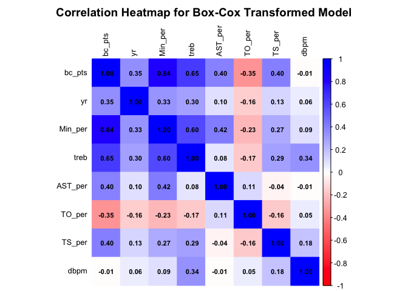<!-- -->

**SUMMARY**

``` r
summary(model_bc)
```

    ## 
    ## Call:
    ## lm(formula = bc_pts ~ yr + Min_per + treb + AST_per + TO_per + 
    ##     TS_per + dbpm + yr:Min_per, data = data_clean2)
    ## 
    ## Residuals:
    ##      Min       1Q   Median       3Q      Max 
    ## -1.93967 -0.33874 -0.01063  0.33106  2.75960 
    ## 
    ## Coefficients:
    ##               Estimate Std. Error t value Pr(>|t|)    
    ## (Intercept)  -0.927224   0.079873 -11.609  < 2e-16 ***
    ## yrJr          0.121290   0.055057   2.203   0.0277 *  
    ## yrSr          0.313942   0.050691   6.193 6.70e-10 ***
    ## Min_per       0.029828   0.001046  28.516  < 2e-16 ***
    ## treb          0.217693   0.007091  30.701  < 2e-16 ***
    ## AST_per       0.034750   0.001569  22.146  < 2e-16 ***
    ## TO_per       -0.029815   0.001523 -19.576  < 2e-16 ***
    ## TS_per        0.029379   0.001229  23.899  < 2e-16 ***
    ## dbpm         -0.110766   0.004695 -23.590  < 2e-16 ***
    ## yrJr:Min_per -0.002389   0.001248  -1.915   0.0556 .  
    ## yrSr:Min_per -0.004635   0.001131  -4.098 4.27e-05 ***
    ## ---
    ## Signif. codes:  0 '***' 0.001 '**' 0.01 '*' 0.05 '.' 0.1 ' ' 1
    ## 
    ## Residual standard error: 0.5332 on 3011 degrees of freedom
    ## Multiple R-squared:  0.8344, Adjusted R-squared:  0.8338 
    ## F-statistic:  1517 on 10 and 3011 DF,  p-value: < 2.2e-16

# 16. Multicollinearity check

``` r
vif(model_bc, type = "predictor")
```

    ## GVIFs computed for predictors

    ##             GVIF Df GVIF^(1/(2*Df)) Interacts With
    ## yr      2.252055  5        1.084571        Min_per
    ## Min_per 2.252055  5        1.084571             yr
    ## treb    1.919155  1        1.385336           --  
    ## AST_per 1.371279  1        1.171016           --  
    ## TO_per  1.144189  1        1.069668           --  
    ## TS_per  1.154442  1        1.074449           --  
    ## dbpm    1.186280  1        1.089165           --  
    ##                                   Other Predictors
    ## yr             treb, AST_per, TO_per, TS_per, dbpm
    ## Min_per        treb, AST_per, TO_per, TS_per, dbpm
    ## treb    yr, Min_per, AST_per, TO_per, TS_per, dbpm
    ## AST_per    yr, Min_per, treb, TO_per, TS_per, dbpm
    ## TO_per    yr, Min_per, treb, AST_per, TS_per, dbpm
    ## TS_per    yr, Min_per, treb, AST_per, TO_per, dbpm
    ## dbpm    yr, Min_per, treb, AST_per, TO_per, TS_per

# 17. Paired plots for multicollinearity check

``` r
# Create dataset of only the Box-Cox model predictors
pairs_data <- data_clean2 %>%
  mutate(
    bc_pts = (pts^lambda - 1) / lambda,
    yr_num = as.numeric(yr)   # convert factor to numeric for pairs plot
  ) %>%
  dplyr::select(
    bc_pts,
    yr_num,
    Min_per,
    treb,
    AST_per,
    TO_per,
    TS_per,
    dbpm
  )

# Paired scatterplot matrix
pairs(
  pairs_data,
  main = "Paired Scatterplots for Final Box-Cox Model Predictors",
  pch = 20,
  cex = 0.6
)
```

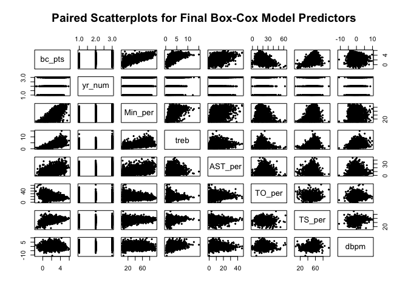<!-- -->

# 18. Graph for interaction

``` r
# Create a sequence of Min_per values covering the observed range
newdata <- expand.grid(
  Min_per = seq(min(data_clean2$Min_per), max(data_clean2$Min_per), length.out = 200),
  yr = levels(data_clean2$yr),
  treb = mean(data_clean2$treb),
  AST_per = mean(data_clean2$AST_per),
  TO_per = mean(data_clean2$TO_per),
  TS_per = mean(data_clean2$TS_per),
  dbpm = mean(data_clean2$dbpm)
)

# Add predictions from the Box-Cox model
newdata$pred <- predict(model_bc, newdata)

ggplot(newdata, aes(x = Min_per, y = pred, color = yr)) +
  geom_line(linewidth = 1.2) +
  labs(
    title = "Interaction Effect of Minutes Percentage by Year\n(Box-Cox Model)",
    x = "Minutes Percentage (Min_per)",
    y = "Predicted Box-Cox Transformed Points",
    color = "Year"
  ) +
  theme_minimal() +
  theme(
    plot.title = element_text(face = "bold", hjust = 0.5),
    panel.border = element_blank(),
    panel.grid.minor = element_blank(),
    legend.position = "bottom"
  )
```

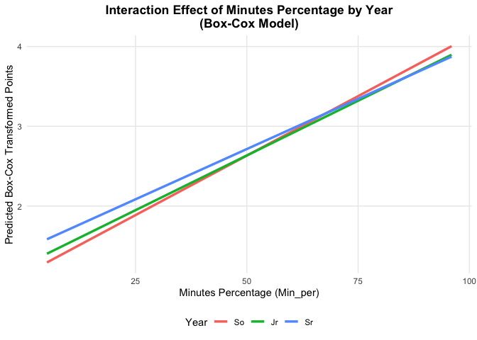<!-- -->

# 19. Forward Backward Transformation

``` r
full_formula <- bc_pts ~ yr + Min_per + treb + AST_per + TO_per +
  TS_per + dbpm + yr:Min_per

model_backward <- stepAIC(
  lm(full_formula, data = data_clean2),
  direction = "backward",
  k = 2   # AIC
)
```

    ## Start:  AIC=-3789.82
    ## bc_pts ~ yr + Min_per + treb + AST_per + TO_per + TS_per + dbpm + 
    ##     yr:Min_per
    ## 
    ##              Df Sum of Sq     RSS     AIC
    ## <none>                     856.04 -3789.8
    ## - yr:Min_per  2     5.013  861.05 -3776.2
    ## - TO_per      1   108.946  964.99 -3429.8
    ## - AST_per     1   139.433  995.47 -3335.8
    ## - dbpm        1   158.216 1014.26 -3279.3
    ## - TS_per      1   162.386 1018.43 -3266.9
    ## - treb        1   267.967 1124.01 -2968.8

``` r
summary(model_backward)
```

    ## 
    ## Call:
    ## lm(formula = bc_pts ~ yr + Min_per + treb + AST_per + TO_per + 
    ##     TS_per + dbpm + yr:Min_per, data = data_clean2)
    ## 
    ## Residuals:
    ##      Min       1Q   Median       3Q      Max 
    ## -1.93967 -0.33874 -0.01063  0.33106  2.75960 
    ## 
    ## Coefficients:
    ##               Estimate Std. Error t value Pr(>|t|)    
    ## (Intercept)  -0.927224   0.079873 -11.609  < 2e-16 ***
    ## yrJr          0.121290   0.055057   2.203   0.0277 *  
    ## yrSr          0.313942   0.050691   6.193 6.70e-10 ***
    ## Min_per       0.029828   0.001046  28.516  < 2e-16 ***
    ## treb          0.217693   0.007091  30.701  < 2e-16 ***
    ## AST_per       0.034750   0.001569  22.146  < 2e-16 ***
    ## TO_per       -0.029815   0.001523 -19.576  < 2e-16 ***
    ## TS_per        0.029379   0.001229  23.899  < 2e-16 ***
    ## dbpm         -0.110766   0.004695 -23.590  < 2e-16 ***
    ## yrJr:Min_per -0.002389   0.001248  -1.915   0.0556 .  
    ## yrSr:Min_per -0.004635   0.001131  -4.098 4.27e-05 ***
    ## ---
    ## Signif. codes:  0 '***' 0.001 '**' 0.01 '*' 0.05 '.' 0.1 ' ' 1
    ## 
    ## Residual standard error: 0.5332 on 3011 degrees of freedom
    ## Multiple R-squared:  0.8344, Adjusted R-squared:  0.8338 
    ## F-statistic:  1517 on 10 and 3011 DF,  p-value: < 2.2e-16

``` r
model_forward <- stepAIC(
  lm(bc_pts ~ 1, data = data_clean2),
  scope = list(upper = lm(full_formula, data = data_clean2)),
  direction = "forward",
  k = 2
)
```

    ## Start:  AIC=1623.95
    ## bc_pts ~ 1
    ## 
    ##           Df Sum of Sq    RSS      AIC
    ## + Min_per  1    3606.1 1562.6 -1989.12
    ## + treb     1    2175.3 2993.5   -24.64
    ## + TS_per   1     831.5 4337.2  1095.91
    ## + AST_per  1     821.0 4347.7  1103.20
    ## + yr       2     655.9 4512.9  1217.88
    ## + TO_per   1     616.9 4551.8  1241.86
    ## <none>                 5168.8  1623.95
    ## + dbpm     1       0.4 5168.3  1625.69
    ## 
    ## Step:  AIC=-1989.12
    ## bc_pts ~ Min_per
    ## 
    ##           Df Sum of Sq    RSS     AIC
    ## + treb     1   183.584 1379.1 -2364.8
    ## + TS_per   1   177.837 1384.8 -2352.2
    ## + TO_per   1   128.759 1433.9 -2247.0
    ## + dbpm     1    40.225 1522.4 -2065.9
    ## + yr       2    34.968 1527.7 -2053.5
    ## + AST_per  1    16.696 1546.0 -2019.6
    ## <none>                 1562.7 -1989.1
    ## 
    ## Step:  AIC=-2364.8
    ## bc_pts ~ Min_per + treb
    ## 
    ##           Df Sum of Sq    RSS     AIC
    ## + dbpm     1   143.221 1235.8 -2694.2
    ## + TS_per   1   124.681 1254.4 -2649.2
    ## + TO_per   1   117.005 1262.1 -2630.7
    ## + AST_per  1    55.748 1323.3 -2487.5
    ## + yr       2    17.444 1361.6 -2399.3
    ## <none>                 1379.1 -2364.8
    ## 
    ## Step:  AIC=-2694.17
    ## bc_pts ~ Min_per + treb + dbpm
    ## 
    ##           Df Sum of Sq    RSS     AIC
    ## + TS_per   1   157.954 1077.9 -3105.4
    ## + TO_per   1    94.314 1141.5 -2932.1
    ## + AST_per  1    61.978 1173.9 -2847.7
    ## + yr       2    15.159 1220.7 -2727.5
    ## <none>                 1235.8 -2694.2
    ## 
    ## Step:  AIC=-3105.43
    ## bc_pts ~ Min_per + treb + dbpm + TS_per
    ## 
    ##           Df Sum of Sq     RSS     AIC
    ## + AST_per  1    94.354  983.53 -3380.3
    ## + TO_per   1    69.110 1008.78 -3303.7
    ## + yr       2    12.815 1065.07 -3137.6
    ## <none>                 1077.89 -3105.4
    ## 
    ## Step:  AIC=-3380.26
    ## bc_pts ~ Min_per + treb + dbpm + TS_per + AST_per
    ## 
    ##          Df Sum of Sq    RSS     AIC
    ## + TO_per  1   114.360 869.17 -3751.8
    ## + yr      2    13.659 969.87 -3418.5
    ## <none>                983.53 -3380.3
    ## 
    ## Step:  AIC=-3751.81
    ## bc_pts ~ Min_per + treb + dbpm + TS_per + AST_per + TO_per
    ## 
    ##        Df Sum of Sq    RSS     AIC
    ## + yr    2    8.1201 861.05 -3776.2
    ## <none>              869.17 -3751.8
    ## 
    ## Step:  AIC=-3776.17
    ## bc_pts ~ Min_per + treb + dbpm + TS_per + AST_per + TO_per + 
    ##     yr
    ## 
    ##              Df Sum of Sq    RSS     AIC
    ## + yr:Min_per  2    5.0127 856.04 -3789.8
    ## <none>                    861.05 -3776.2
    ## 
    ## Step:  AIC=-3789.82
    ## bc_pts ~ Min_per + treb + dbpm + TS_per + AST_per + TO_per + 
    ##     yr + Min_per:yr

``` r
summary(model_forward)
```

    ## 
    ## Call:
    ## lm(formula = bc_pts ~ Min_per + treb + dbpm + TS_per + AST_per + 
    ##     TO_per + yr + Min_per:yr, data = data_clean2)
    ## 
    ## Residuals:
    ##      Min       1Q   Median       3Q      Max 
    ## -1.93967 -0.33874 -0.01063  0.33106  2.75960 
    ## 
    ## Coefficients:
    ##               Estimate Std. Error t value Pr(>|t|)    
    ## (Intercept)  -0.927224   0.079873 -11.609  < 2e-16 ***
    ## Min_per       0.029828   0.001046  28.516  < 2e-16 ***
    ## treb          0.217693   0.007091  30.701  < 2e-16 ***
    ## dbpm         -0.110766   0.004695 -23.590  < 2e-16 ***
    ## TS_per        0.029379   0.001229  23.899  < 2e-16 ***
    ## AST_per       0.034750   0.001569  22.146  < 2e-16 ***
    ## TO_per       -0.029815   0.001523 -19.576  < 2e-16 ***
    ## yrJr          0.121290   0.055057   2.203   0.0277 *  
    ## yrSr          0.313942   0.050691   6.193 6.70e-10 ***
    ## Min_per:yrJr -0.002389   0.001248  -1.915   0.0556 .  
    ## Min_per:yrSr -0.004635   0.001131  -4.098 4.27e-05 ***
    ## ---
    ## Signif. codes:  0 '***' 0.001 '**' 0.01 '*' 0.05 '.' 0.1 ' ' 1
    ## 
    ## Residual standard error: 0.5332 on 3011 degrees of freedom
    ## Multiple R-squared:  0.8344, Adjusted R-squared:  0.8338 
    ## F-statistic:  1517 on 10 and 3011 DF,  p-value: < 2.2e-16

``` r
model_stepwise <- stepAIC(
  lm(bc_pts ~ 1, data = data_clean2),
  scope = list(upper = lm(full_formula, data = data_clean2)),
  direction = "both",
  k = 2
)
```

    ## Start:  AIC=1623.95
    ## bc_pts ~ 1
    ## 
    ##           Df Sum of Sq    RSS      AIC
    ## + Min_per  1    3606.1 1562.6 -1989.12
    ## + treb     1    2175.3 2993.5   -24.64
    ## + TS_per   1     831.5 4337.2  1095.91
    ## + AST_per  1     821.0 4347.7  1103.20
    ## + yr       2     655.9 4512.9  1217.88
    ## + TO_per   1     616.9 4551.8  1241.86
    ## <none>                 5168.8  1623.95
    ## + dbpm     1       0.4 5168.3  1625.69
    ## 
    ## Step:  AIC=-1989.12
    ## bc_pts ~ Min_per
    ## 
    ##           Df Sum of Sq    RSS     AIC
    ## + treb     1     183.6 1379.1 -2364.8
    ## + TS_per   1     177.8 1384.8 -2352.2
    ## + TO_per   1     128.8 1433.9 -2247.0
    ## + dbpm     1      40.2 1522.4 -2065.9
    ## + yr       2      35.0 1527.7 -2053.5
    ## + AST_per  1      16.7 1546.0 -2019.6
    ## <none>                 1562.6 -1989.1
    ## - Min_per  1    3606.1 5168.8  1624.0
    ## 
    ## Step:  AIC=-2364.8
    ## bc_pts ~ Min_per + treb
    ## 
    ##           Df Sum of Sq    RSS      AIC
    ## + dbpm     1    143.22 1235.8 -2694.17
    ## + TS_per   1    124.68 1254.4 -2649.17
    ## + TO_per   1    117.00 1262.1 -2630.73
    ## + AST_per  1     55.75 1323.3 -2487.50
    ## + yr       2     17.44 1361.6 -2399.27
    ## <none>                 1379.1 -2364.80
    ## - treb     1    183.58 1562.7 -1989.12
    ## - Min_per  1   1614.43 2993.5   -24.64
    ## 
    ## Step:  AIC=-2694.17
    ## bc_pts ~ Min_per + treb + dbpm
    ## 
    ##           Df Sum of Sq    RSS      AIC
    ## + TS_per   1    157.95 1077.9 -3105.43
    ## + TO_per   1     94.31 1141.5 -2932.07
    ## + AST_per  1     61.98 1173.9 -2847.66
    ## + yr       2     15.16 1220.7 -2727.47
    ## <none>                 1235.8 -2694.17
    ## - dbpm     1    143.22 1379.1 -2364.80
    ## - treb     1    286.58 1522.4 -2065.93
    ## - Min_per  1   1445.91 2681.8  -354.97
    ## 
    ## Step:  AIC=-3105.43
    ## bc_pts ~ Min_per + treb + dbpm + TS_per
    ## 
    ##           Df Sum of Sq     RSS     AIC
    ## + AST_per  1     94.35  983.53 -3380.3
    ## + TO_per   1     69.11 1008.78 -3303.7
    ## + yr       2     12.81 1065.07 -3137.6
    ## <none>                 1077.89 -3105.4
    ## - TS_per   1    157.95 1235.84 -2694.2
    ## - dbpm     1    176.49 1254.38 -2649.2
    ## - treb     1    232.31 1310.20 -2517.6
    ## - Min_per  1   1294.23 2372.12  -723.7
    ## 
    ## Step:  AIC=-3380.26
    ## bc_pts ~ Min_per + treb + dbpm + TS_per + AST_per
    ## 
    ##           Df Sum of Sq     RSS     AIC
    ## + TO_per   1    114.36  869.17 -3751.8
    ## + yr       2     13.66  969.87 -3418.5
    ## <none>                  983.53 -3380.3
    ## - AST_per  1     94.35 1077.89 -3105.4
    ## - dbpm     1    188.97 1172.51 -2851.2
    ## - TS_per   1    190.33 1173.86 -2847.7
    ## - treb     1    288.12 1271.66 -2605.8
    ## - Min_per  1    731.59 1715.13 -1701.8
    ## 
    ## Step:  AIC=-3751.81
    ## bc_pts ~ Min_per + treb + dbpm + TS_per + AST_per + TO_per
    ## 
    ##           Df Sum of Sq     RSS     AIC
    ## + yr       2      8.12  861.05 -3776.2
    ## <none>                  869.17 -3751.8
    ## - TO_per   1    114.36  983.53 -3380.3
    ## - AST_per  1    139.60 1008.78 -3303.7
    ## - dbpm     1    158.80 1027.98 -3246.7
    ## - TS_per   1    164.25 1033.43 -3230.7
    ## - treb     1    284.76 1153.93 -2897.4
    ## - Min_per  1    575.67 1444.85 -2218.0
    ## 
    ## Step:  AIC=-3776.17
    ## bc_pts ~ Min_per + treb + dbpm + TS_per + AST_per + TO_per + 
    ##     yr
    ## 
    ##              Df Sum of Sq     RSS     AIC
    ## + yr:Min_per  2      5.01  856.04 -3789.8
    ## <none>                     861.05 -3776.2
    ## - yr          2      8.12  869.17 -3751.8
    ## - TO_per      1    108.82  969.87 -3418.5
    ## - AST_per     1    139.09 1000.15 -3325.6
    ## - dbpm        1    157.42 1018.47 -3270.8
    ## - TS_per      1    163.04 1024.09 -3254.1
    ## - treb        1    269.18 1130.24 -2956.1
    ## - Min_per     1    541.03 1402.08 -2304.8
    ## 
    ## Step:  AIC=-3789.82
    ## bc_pts ~ Min_per + treb + dbpm + TS_per + AST_per + TO_per + 
    ##     yr + Min_per:yr
    ## 
    ##              Df Sum of Sq     RSS     AIC
    ## <none>                     856.04 -3789.8
    ## - Min_per:yr  2     5.013  861.05 -3776.2
    ## - TO_per      1   108.946  964.99 -3429.8
    ## - AST_per     1   139.433  995.47 -3335.8
    ## - dbpm        1   158.216 1014.26 -3279.3
    ## - TS_per      1   162.386 1018.43 -3266.9
    ## - treb        1   267.967 1124.01 -2968.8

``` r
summary(model_stepwise)
```

    ## 
    ## Call:
    ## lm(formula = bc_pts ~ Min_per + treb + dbpm + TS_per + AST_per + 
    ##     TO_per + yr + Min_per:yr, data = data_clean2)
    ## 
    ## Residuals:
    ##      Min       1Q   Median       3Q      Max 
    ## -1.93967 -0.33874 -0.01063  0.33106  2.75960 
    ## 
    ## Coefficients:
    ##               Estimate Std. Error t value Pr(>|t|)    
    ## (Intercept)  -0.927224   0.079873 -11.609  < 2e-16 ***
    ## Min_per       0.029828   0.001046  28.516  < 2e-16 ***
    ## treb          0.217693   0.007091  30.701  < 2e-16 ***
    ## dbpm         -0.110766   0.004695 -23.590  < 2e-16 ***
    ## TS_per        0.029379   0.001229  23.899  < 2e-16 ***
    ## AST_per       0.034750   0.001569  22.146  < 2e-16 ***
    ## TO_per       -0.029815   0.001523 -19.576  < 2e-16 ***
    ## yrJr          0.121290   0.055057   2.203   0.0277 *  
    ## yrSr          0.313942   0.050691   6.193 6.70e-10 ***
    ## Min_per:yrJr -0.002389   0.001248  -1.915   0.0556 .  
    ## Min_per:yrSr -0.004635   0.001131  -4.098 4.27e-05 ***
    ## ---
    ## Signif. codes:  0 '***' 0.001 '**' 0.01 '*' 0.05 '.' 0.1 ' ' 1
    ## 
    ## Residual standard error: 0.5332 on 3011 degrees of freedom
    ## Multiple R-squared:  0.8344, Adjusted R-squared:  0.8338 
    ## F-statistic:  1517 on 10 and 3011 DF,  p-value: < 2.2e-16

``` r
AIC(model_backward, model_forward, model_stepwise)
```

    ##                df      AIC
    ## model_backward 12 4788.246
    ## model_forward  12 4788.246
    ## model_stepwise 12 4788.246

``` r
BIC(model_backward, model_forward, model_stepwise)
```

    ##                df     BIC
    ## model_backward 12 4860.41
    ## model_forward  12 4860.41
    ## model_stepwise 12 4860.41

# 20. Test if Min_per is relevent

``` r
model_no_interaction <- update(model_bc, . ~ . - yr:Min_per)

anova(model_no_interaction, model_bc)
```

    ## Analysis of Variance Table
    ## 
    ## Model 1: bc_pts ~ yr + Min_per + treb + AST_per + TO_per + TS_per + dbpm
    ## Model 2: bc_pts ~ yr + Min_per + treb + AST_per + TO_per + TS_per + dbpm + 
    ##     yr:Min_per
    ##   Res.Df    RSS Df Sum of Sq      F    Pr(>F)    
    ## 1   3013 861.05                                  
    ## 2   3011 856.04  2    5.0127 8.8157 0.0001523 ***
    ## ---
    ## Signif. codes:  0 '***' 0.001 '**' 0.01 '*' 0.05 '.' 0.1 ' ' 1

``` r
model_no_min <- update(model_no_interaction, . ~ . - Min_per)

anova(model_no_interaction, model_no_min)
```

    ## Analysis of Variance Table
    ## 
    ## Model 1: bc_pts ~ yr + Min_per + treb + AST_per + TO_per + TS_per + dbpm
    ## Model 2: bc_pts ~ yr + treb + AST_per + TO_per + TS_per + dbpm
    ##   Res.Df     RSS Df Sum of Sq      F    Pr(>F)    
    ## 1   3013  861.05                                  
    ## 2   3014 1402.08 -1   -541.03 1893.2 < 2.2e-16 ***
    ## ---
    ## Signif. codes:  0 '***' 0.001 '**' 0.01 '*' 0.05 '.' 0.1 ' ' 1

# Split Model

``` r
set.seed(67)

data_val <- data_clean2     

n <- nrow(data_val)

train_index <- sample(1:n, size = 0.8*n, replace = FALSE) #80/20 split used

train <- data_val[train_index, ]
test  <- data_val[-train_index, ]
```

# Build model in each dataset

``` r
# refit final model onto training set
model_train <- lm(
  bc_pts ~ yr + Min_per + treb + AST_per + TO_per + 
    TS_per + dbpm + yr:Min_per, data = train)

summary(model_train)
```

    ## 
    ## Call:
    ## lm(formula = bc_pts ~ yr + Min_per + treb + AST_per + TO_per + 
    ##     TS_per + dbpm + yr:Min_per, data = train)
    ## 
    ## Residuals:
    ##      Min       1Q   Median       3Q      Max 
    ## -1.72958 -0.34003 -0.00622  0.33442  2.70101 
    ## 
    ## Coefficients:
    ##               Estimate Std. Error t value Pr(>|t|)    
    ## (Intercept)  -1.020020   0.090837 -11.229  < 2e-16 ***
    ## yrJr          0.138421   0.062075   2.230   0.0258 *  
    ## yrSr          0.342921   0.056721   6.046 1.72e-09 ***
    ## Min_per       0.029552   0.001161  25.464  < 2e-16 ***
    ## treb          0.222044   0.007900  28.108  < 2e-16 ***
    ## AST_per       0.036820   0.001749  21.057  < 2e-16 ***
    ## TO_per       -0.030761   0.001718 -17.909  < 2e-16 ***
    ## TS_per        0.030751   0.001387  22.173  < 2e-16 ***
    ## dbpm         -0.117109   0.005212 -22.467  < 2e-16 ***
    ## yrJr:Min_per -0.002348   0.001387  -1.693   0.0907 .  
    ## yrSr:Min_per -0.005042   0.001255  -4.019 6.02e-05 ***
    ## ---
    ## Signif. codes:  0 '***' 0.001 '**' 0.01 '*' 0.05 '.' 0.1 ' ' 1
    ## 
    ## Residual standard error: 0.5283 on 2406 degrees of freedom
    ## Multiple R-squared:  0.8374, Adjusted R-squared:  0.8367 
    ## F-statistic:  1239 on 10 and 2406 DF,  p-value: < 2.2e-16

``` r
# refit final model onto testing set
model_test <- lm(bc_pts ~ yr + Min_per + treb + AST_per + TO_per +
    TS_per + dbpm + yr:Min_per,data = test)

summary(model_test)
```

    ## 
    ## Call:
    ## lm(formula = bc_pts ~ yr + Min_per + treb + AST_per + TO_per + 
    ##     TS_per + dbpm + yr:Min_per, data = test)
    ## 
    ## Residuals:
    ##      Min       1Q   Median       3Q      Max 
    ## -1.73673 -0.31927 -0.01757  0.30887  2.39186 
    ## 
    ## Coefficients:
    ##               Estimate Std. Error t value Pr(>|t|)    
    ## (Intercept)  -0.639209   0.168968  -3.783 0.000171 ***
    ## yrJr          0.093514   0.119951   0.780 0.435934    
    ## yrSr          0.230487   0.113506   2.031 0.042740 *  
    ## Min_per       0.031140   0.002424  12.845  < 2e-16 ***
    ## treb          0.202577   0.016008  12.655  < 2e-16 ***
    ## AST_per       0.027030   0.003541   7.632 9.22e-14 ***
    ## TO_per       -0.026068   0.003330  -7.829 2.27e-14 ***
    ## TS_per        0.024847   0.002659   9.344  < 2e-16 ***
    ## dbpm         -0.088419   0.010859  -8.142 2.29e-15 ***
    ## yrJr:Min_per -0.003185   0.002863  -1.113 0.266354    
    ## yrSr:Min_per -0.003518   0.002621  -1.342 0.179947    
    ## ---
    ## Signif. codes:  0 '***' 0.001 '**' 0.01 '*' 0.05 '.' 0.1 ' ' 1
    ## 
    ## Residual standard error: 0.5483 on 594 degrees of freedom
    ## Multiple R-squared:  0.8279, Adjusted R-squared:  0.825 
    ## F-statistic: 285.7 on 10 and 594 DF,  p-value: < 2.2e-16

# Compare the two models using VIF

``` r
#check VIFs

vif(model_train)
```

    ## there are higher-order terms (interactions) in this model
    ## consider setting type = 'predictor'; see ?vif

    ##                 GVIF Df GVIF^(1/(2*Df))
    ## yr         22.458355  2        2.176930
    ## Min_per     6.434497  1        2.536631
    ## treb        1.911770  1        1.382668
    ## AST_per     1.375063  1        1.172631
    ## TO_per      1.148187  1        1.071535
    ## TS_per      1.167011  1        1.080283
    ## dbpm        1.190594  1        1.091143
    ## yr:Min_per 55.408727  2        2.728315

``` r
vif(model_test)
```

    ## there are higher-order terms (interactions) in this model
    ## consider setting type = 'predictor'; see ?vif

    ##                 GVIF Df GVIF^(1/(2*Df))
    ## yr         20.025503  2        2.115416
    ## Min_per     7.024811  1        2.650436
    ## treb        1.958703  1        1.399537
    ## AST_per     1.368286  1        1.169738
    ## TO_per      1.164924  1        1.079316
    ## TS_per      1.123634  1        1.060016
    ## dbpm        1.198939  1        1.094961
    ## yr:Min_per 54.961268  2        2.722790

# Check Assumptions

``` r
# check assumptions in training
par(mfrow=c(3,3))
plot(train$bc_pts ~ fitted(model_train), xlab="fitted", ylab="response", 
     main="Model in Training Data", cex.main=1.5)
plot(residuals(model_train) ~ fitted(model_train), xlab="fitted", ylab="residuals")
for(i in c(2,3,5,6)){
  plot(residuals(model_train) ~ train[[i]], xlab=names(train)[i], ylab="residuals")}
qqnorm(residuals(model_train))
qqline(residuals(model_train))
par(mfrow=c(1,1))
```

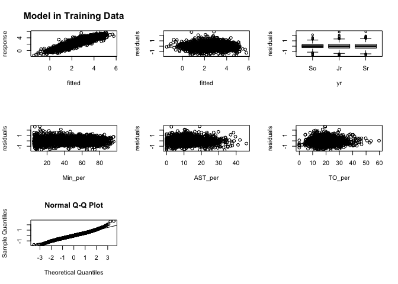<!-- -->

``` r
# check assumptions in test
par(mfrow = c(3,3))

plot(test$bc_pts ~ fitted(model_test), xlab="fitted", ylab="response")
title("Model in Test Data", cex.main = 1.5)

plot(residuals(model_test) ~ fitted(model_test), xlab="fitted", ylab="residuals")
for(i in c(2,3,5,6)){
  plot(residuals(model_test) ~ test[[i]], xlab=names(test)[i], ylab="residuals")}

qqnorm(residuals(model_test))
qqline(residuals(model_test))
par(mfrow = c(1,1))
```

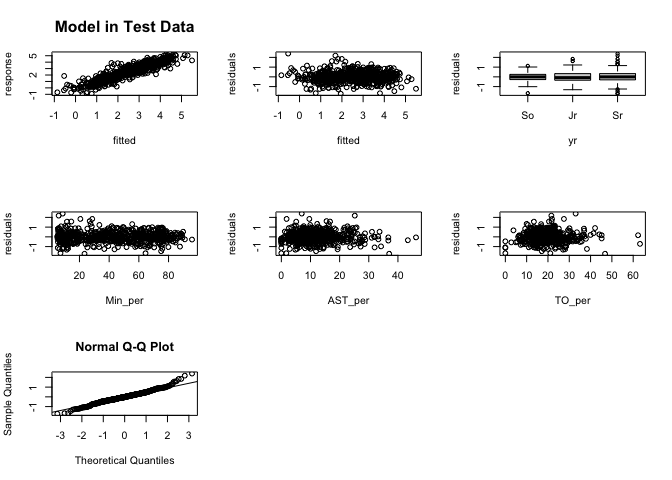<!-- -->

# Check Problematic Points

``` r
# checking problematic observations for train
print("Training Dataset")
```

    ## [1] "Training Dataset"

``` r
# useful values:
n <- nrow(train)
p <- length(coef(model_train))-1
# leverage cutoff
h_cut <- 2*(p+1)/n
print("Leverage Points")
```

    ## [1] "Leverage Points"

``` r
which(hatvalues(model_train) > h_cut)
```

    ##   12   34   35   42   43   63   99  109  131  147  156  185  189  195  204  210 
    ##   12   34   35   42   43   63   99  109  131  147  156  185  189  195  204  210 
    ##  218  222  251  293  294  330  348  369  462  490  532  536  548  579  580  583 
    ##  218  222  251  293  294  330  348  369  462  490  532  536  548  579  580  583 
    ##  592  593  606  608  614  618  627  656  692  711  722  729  730  755  782  783 
    ##  592  593  606  608  614  618  627  656  692  711  722  729  730  755  782  783 
    ##  788  802  823  831  838  839  845  853  865  866  867  881  903  920  938  983 
    ##  788  802  823  831  838  839  845  853  865  866  867  881  903  920  938  983 
    ##  990  998 1004 1013 1026 1034 1035 1054 1055 1062 1070 1071 1106 1107 1125 1138 
    ##  990  998 1004 1013 1026 1034 1035 1054 1055 1062 1070 1071 1106 1107 1125 1138 
    ## 1143 1145 1156 1163 1171 1191 1198 1208 1232 1271 1272 1292 1334 1382 1407 1457 
    ## 1143 1145 1156 1163 1171 1191 1198 1208 1232 1271 1272 1292 1334 1382 1407 1457 
    ## 1499 1500 1509 1533 1540 1541 1545 1577 1582 1583 1606 1610 1632 1667 1671 1676 
    ## 1499 1500 1509 1533 1540 1541 1545 1577 1582 1583 1606 1610 1632 1667 1671 1676 
    ## 1718 1721 1739 1744 1755 1761 1806 1819 1898 1908 1913 1917 1941 1959 1985 1988 
    ## 1718 1721 1739 1744 1755 1761 1806 1819 1898 1908 1913 1917 1941 1959 1985 1988 
    ## 2006 2038 2046 2066 2068 2094 2095 2100 2104 2114 2117 2146 2189 2191 2218 2219 
    ## 2006 2038 2046 2066 2068 2094 2095 2100 2104 2114 2117 2146 2189 2191 2218 2219 
    ## 2223 2240 2252 2272 2278 2290 2326 2366 2376 2383 2396 
    ## 2223 2240 2252 2272 2278 2290 2326 2366 2376 2383 2396

``` r
# outliers
print("Outliers")
```

    ## [1] "Outliers"

``` r
which(rstandard(model_train) > 2 | rstandard(model_train) < -2)
```

    ##   63  113  118  131  154  155  218  236  249  251  255  274  279  292  293  302 
    ##   63  113  118  131  154  155  218  236  249  251  255  274  279  292  293  302 
    ##  303  418  421  444  458  480  488  496  532  552  575  579  611  631  674  681 
    ##  303  418  421  444  458  480  488  496  532  552  575  579  611  631  674  681 
    ##  698  728  741  756  785  805  806  811  823  848  871  899  910  933  934  970 
    ##  698  728  741  756  785  805  806  811  823  848  871  899  910  933  934  970 
    ##  972  977  983  985  998 1038 1062 1078 1107 1170 1191 1242 1260 1282 1286 1307 
    ##  972  977  983  985  998 1038 1062 1078 1107 1170 1191 1242 1260 1282 1286 1307 
    ## 1315 1347 1387 1420 1432 1435 1442 1453 1461 1491 1523 1540 1577 1583 1598 1599 
    ## 1315 1347 1387 1420 1432 1435 1442 1453 1461 1491 1523 1540 1577 1583 1598 1599 
    ## 1630 1649 1671 1683 1686 1739 1755 1777 1793 1829 1925 1940 1957 1982 2005 2024 
    ## 1630 1649 1671 1683 1686 1739 1755 1777 1793 1829 1925 1940 1957 1982 2005 2024 
    ## 2043 2053 2077 2093 2096 2119 2131 2146 2179 2189 2223 2240 2261 2278 2283 2292 
    ## 2043 2053 2077 2093 2096 2119 2131 2146 2179 2189 2223 2240 2261 2278 2283 2292 
    ## 2305 2366 2380 2383 
    ## 2305 2366 2380 2383

``` r
# cooks cutoff
print("Influence (Cooks)")
```

    ## [1] "Influence (Cooks)"

``` r
D_cut <- qf(0.5, p+1, n-p-1)
which(cooks.distance(model_train) > D_cut)
```

    ## named integer(0)

``` r
# DFFITS cutoff
fits_cut <- 2*sqrt((p+1)/n)
print("Influence (DFFITS)")
```

    ## [1] "Influence (DFFITS)"

``` r
which(abs(dffits(model_train)) > fits_cut)
```

    ##   10   43   53   63  109  113  118  131  154  155  156  185  210  218  219  222 
    ##   10   43   53   63  109  113  118  131  154  155  156  185  210  218  219  222 
    ##  225  236  249  251  253  274  279  283  292  293  294  303  330  369  379  393 
    ##  225  236  249  251  253  274  279  283  292  293  294  303  330  369  379  393 
    ##  403  418  431  458  463  480  488  496  532  536  552  553  559  575  579  583 
    ##  403  418  431  458  463  480  488  496  532  536  552  553  559  575  579  583 
    ##  593  608  631  646  674  681  698  728  729  741  756  799  802  806  811  819 
    ##  593  608  631  646  674  681  698  728  729  741  756  799  802  806  811  819 
    ##  823  845  871  881  933  934  970  972  977  983  985  998 1032 1034 1038 1062 
    ##  823  845  871  881  933  934  970  972  977  983  985  998 1032 1034 1038 1062 
    ## 1070 1075 1078 1095 1107 1112 1156 1191 1194 1198 1242 1260 1272 1286 1310 1315 
    ## 1070 1075 1078 1095 1107 1112 1156 1191 1194 1198 1242 1260 1272 1286 1310 1315 
    ## 1387 1388 1420 1432 1453 1461 1491 1499 1523 1540 1541 1545 1577 1582 1583 1599 
    ## 1387 1388 1420 1432 1453 1461 1491 1499 1523 1540 1541 1545 1577 1582 1583 1599 
    ## 1630 1641 1649 1671 1683 1739 1755 1777 1829 1913 1925 1957 1982 2005 2024 2043 
    ## 1630 1641 1649 1671 1683 1739 1755 1777 1829 1913 1925 1957 1982 2005 2024 2043 
    ## 2053 2068 2069 2077 2089 2094 2095 2096 2114 2119 2131 2146 2179 2189 2199 2223 
    ## 2053 2068 2069 2077 2089 2094 2095 2096 2114 2119 2131 2146 2179 2189 2199 2223 
    ## 2240 2278 2283 2335 2366 2380 2383 2396 
    ## 2240 2278 2283 2335 2366 2380 2383 2396

``` r
# DFBETAS cutoff
beta_cut <- 2/sqrt(n)
print("Influence (DFBETA)")
```

    ## [1] "Influence (DFBETA)"

``` r
for(i in 1:ncol(dfbetas(model_train))){
  print(paste0("Beta ", i-1))
  print(which(abs(dfbetas(model_train)[,i]) > beta_cut))}
```

    ## [1] "Beta 0"
    ##   10   14   63   65   71   99  109  159  204  219  222  236  251  254  293  303 
    ##   10   14   63   65   71   99  109  159  204  219  222  236  251  254  293  303 
    ##  332  369  377  379  382  400  431  458  462  463  473  488  495  526  532  539 
    ##  332  369  377  379  382  400  431  458  462  463  473  488  495  526  532  539 
    ##  545  546  553  579  592  593  621  627  674  681  688  698  701  729  739  741 
    ##  545  546  553  579  592  593  621  627  674  681  688  698  701  729  739  741 
    ##  756  802  823  845  853  865  866  871  881  910  938  985  990 1027 1032 1034 
    ##  756  802  823  845  853  865  866  871  881  910  938  985  990 1027 1032 1034 
    ## 1038 1068 1070 1075 1107 1132 1138 1189 1191 1194 1260 1370 1388 1432 1444 1445 
    ## 1038 1068 1070 1075 1107 1132 1138 1189 1191 1194 1260 1370 1388 1432 1444 1445 
    ## 1461 1467 1484 1491 1499 1540 1545 1561 1579 1582 1583 1584 1599 1606 1629 1641 
    ## 1461 1467 1484 1491 1499 1540 1545 1561 1579 1582 1583 1584 1599 1606 1629 1641 
    ## 1739 1755 1777 1801 1811 1829 1910 1924 1925 1935 1957 1982 1991 2043 2053 2069 
    ## 1739 1755 1777 1801 1811 1829 1910 1924 1925 1935 1957 1982 1991 2043 2053 2069 
    ## 2077 2089 2094 2095 2096 2114 2146 2148 2154 2167 2179 2189 2199 2217 2223 2237 
    ## 2077 2089 2094 2095 2096 2114 2146 2148 2154 2167 2179 2189 2199 2217 2223 2237 
    ## 2240 2278 2290 2335 2350 2377 2380 2383 
    ## 2240 2278 2290 2335 2350 2377 2380 2383 
    ## [1] "Beta 1"
    ##   10   63   93   99  118  155  168  185  199  222  228  236  240  249  251  274 
    ##   10   63   93   99  118  155  168  185  199  222  228  236  240  249  251  274 
    ##  279  283  312  330  369  377  402  403  416  431  458  462  464  480  482  486 
    ##  279  283  312  330  369  377  402  403  416  431  458  462  464  480  482  486 
    ##  492  494  496  503  526  531  532  546  553  559  574  575  579  583  592  618 
    ##  492  494  496  503  526  531  532  546  553  559  574  575  579  583  592  618 
    ##  627  673  698  719  728  730  739  741  743  749  756  769  778  799  802  831 
    ##  627  673  698  719  728  730  739  741  743  749  756  769  778  799  802  831 
    ##  866  871  881  938  940  948  970  979  983  998 1014 1015 1032 1034 1039 1062 
    ##  866  871  881  938  940  948  970  979  983  998 1014 1015 1032 1034 1039 1062 
    ## 1077 1147 1156 1174 1191 1194 1285 1292 1416 1420 1432 1453 1461 1467 1487 1489 
    ## 1077 1147 1156 1174 1191 1194 1285 1292 1416 1420 1432 1453 1461 1467 1487 1489 
    ## 1491 1499 1510 1528 1540 1541 1579 1584 1606 1618 1636 1649 1664 1683 1755 1766 
    ## 1491 1499 1510 1528 1540 1541 1579 1584 1606 1618 1636 1649 1664 1683 1755 1766 
    ## 1777 1811 1817 1862 1894 1913 1935 1991 2024 2052 2069 2094 2096 2114 2119 2131 
    ## 1777 1811 1817 1862 1894 1913 1935 1991 2024 2052 2069 2094 2096 2114 2119 2131 
    ## 2136 2146 2164 2167 2179 2234 2237 2238 2240 2256 2278 2281 2283 2296 2326 2350 
    ## 2136 2146 2164 2167 2179 2234 2237 2238 2240 2256 2278 2281 2283 2296 2326 2350 
    ## 2366 2380 2383 2406 
    ## 2366 2380 2383 2406 
    ## [1] "Beta 2"
    ##   22   53   84  125  131  138  154  161  167  193  204  218  225  236  254  279 
    ##   22   53   84  125  131  138  154  161  167  193  204  218  225  236  254  279 
    ##  283  284  293  312  330  369  382  421  431  444  458  463  473  477  480  482 
    ##  283  284  293  312  330  369  382  421  431  444  458  463  473  477  480  482 
    ##  488  495  496  526  533  539  546  552  578  592  610  627  674  681  688  729 
    ##  488  495  496  526  533  539  546  552  578  592  610  627  674  681  688  729 
    ##  730  739  749  778  780  799  802  806  811  845  871  910  914  924  933  934 
    ##  730  739  749  778  780  799  802  806  811  845  871  910  914  924  933  934 
    ##  940  970  972  979  983  985 1037 1039 1070 1075 1095 1097 1107 1128 1145 1149 
    ##  940  970  972  979  983  985 1037 1039 1070 1075 1095 1097 1107 1128 1145 1149 
    ## 1156 1182 1190 1191 1194 1242 1246 1260 1286 1298 1310 1316 1381 1387 1398 1407 
    ## 1156 1182 1190 1191 1194 1242 1246 1260 1286 1298 1310 1316 1381 1387 1398 1407 
    ## 1416 1420 1435 1442 1445 1467 1510 1540 1541 1545 1577 1582 1583 1599 1618 1629 
    ## 1416 1420 1435 1442 1445 1467 1510 1540 1541 1545 1577 1582 1583 1599 1618 1629 
    ## 1641 1665 1669 1671 1695 1721 1739 1753 1755 1759 1764 1766 1777 1801 1811 1817 
    ## 1641 1665 1669 1671 1695 1721 1739 1753 1755 1759 1764 1766 1777 1801 1811 1817 
    ## 1829 1862 1894 1913 1919 1924 1925 1940 1943 1957 1982 1991 2005 2013 2038 2059 
    ## 1829 1862 1894 1913 1919 1924 1925 1940 1943 1957 1982 1991 2005 2013 2038 2059 
    ## 2069 2077 2089 2094 2095 2096 2114 2119 2167 2199 2223 2232 2234 2238 2256 2281 
    ## 2069 2077 2089 2094 2095 2096 2114 2119 2167 2199 2223 2232 2234 2238 2256 2281 
    ## 2283 2290 2331 2350 2390 2396 2409 2415 
    ## 2283 2290 2331 2350 2390 2396 2409 2415 
    ## [1] "Beta 3"
    ##   34   35   53   66  109  118  131  156  193  195  221  226  249  253  279  283 
    ##   34   35   53   66  109  118  131  156  193  195  221  226  249  253  279  283 
    ##  292  294  312  330  369  422  458  480  482  485  532  536  540  592  593  606 
    ##  292  294  312  330  369  422  458  480  482  485  532  536  540  592  593  606 
    ##  608  614  627  674  677  688  692  730  741  749  778  794  802  819  823  871 
    ##  608  614  627  674  677  688  692  730  741  749  778  794  802  819  823  871 
    ##  878  940  943  958  970  979  983 1008 1032 1039 1041 1042 1057 1062 1100 1107 
    ##  878  940  943  958  970  979  983 1008 1032 1039 1041 1042 1057 1062 1100 1107 
    ## 1138 1145 1156 1191 1194 1198 1260 1272 1393 1402 1416 1420 1425 1432 1460 1467 
    ## 1138 1145 1156 1191 1194 1198 1260 1272 1393 1402 1416 1420 1425 1432 1460 1467 
    ## 1491 1510 1540 1541 1577 1583 1618 1650 1658 1671 1718 1744 1753 1755 1761 1766 
    ## 1491 1510 1540 1541 1577 1583 1618 1650 1658 1671 1718 1744 1753 1755 1761 1766 
    ## 1777 1778 1783 1811 1817 1819 1840 1862 1894 1913 1925 1991 2006 2043 2068 2069 
    ## 1777 1778 1783 1811 1817 1819 1840 1862 1894 1913 1925 1991 2006 2043 2068 2069 
    ## 2094 2114 2119 2146 2199 2201 2221 2223 2234 2238 2252 2256 2281 2283 2289 2308 
    ## 2094 2114 2119 2146 2199 2201 2221 2223 2234 2238 2252 2256 2281 2283 2289 2308 
    ## 2350 2376 2383 2415 
    ## 2350 2376 2383 2415 
    ## [1] "Beta 4"
    ##   16   43   53   71   87  113  118  131  137  154  156  205  210  218  225  235 
    ##   16   43   53   71   87  113  118  131  137  154  156  205  210  218  225  235 
    ##  247  249  251  253  255  273  294  303  331  369  386  394  430  447  464  488 
    ##  247  249  251  253  255  273  294  303  331  369  386  394  430  447  464  488 
    ##  532  536  575  593  608  631  674  724  741  756  773  785  787  805  811  819 
    ##  532  536  575  593  608  631  674  724  741  756  773  785  787  805  811  819 
    ##  821  823  871  885  893  898  914  965  970  985 1004 1010 1032 1038 1062 1067 
    ##  821  823  871  885  893  898  914  965  970  985 1004 1010 1032 1038 1062 1067 
    ## 1095 1100 1107 1191 1198 1200 1231 1255 1260 1272 1282 1286 1307 1309 1310 1362 
    ## 1095 1100 1107 1191 1198 1200 1231 1255 1260 1272 1282 1286 1307 1309 1310 1362 
    ## 1432 1491 1557 1576 1577 1583 1591 1607 1630 1641 1651 1656 1671 1724 1739 1745 
    ## 1432 1491 1557 1576 1577 1583 1591 1607 1630 1641 1651 1656 1671 1724 1739 1745 
    ## 1755 1821 1849 1895 1904 1908 1913 1925 1942 1956 1959 2005 2024 2029 2043 2068 
    ## 1755 1821 1849 1895 1904 1908 1913 1925 1942 1956 1959 2005 2024 2029 2043 2068 
    ## 2085 2119 2128 2140 2141 2146 2188 2213 2223 2232 2239 2261 2286 2305 2350 2374 
    ## 2085 2119 2128 2140 2141 2146 2188 2213 2223 2232 2239 2261 2286 2305 2350 2374 
    ## 2376 2378 2383 
    ## 2376 2378 2383 
    ## [1] "Beta 5"
    ##   10   16   43   53   84  102  118  131  142  154  176  183  203  219  249  279 
    ##   10   16   43   53   84  102  118  131  142  154  176  183  203  219  249  279 
    ##  293  294  307  330  369  379  382  393  403  418  430  458  463  488  500  531 
    ##  293  294  307  330  369  379  382  393  403  418  430  458  463  488  500  531 
    ##  532  552  593  602  614  627  646  656  674  681  719  728  741  773  785  787 
    ##  532  552  593  602  614  627  646  656  674  681  719  728  741  773  785  787 
    ##  811  819  821  822  823  848  881  885  893  905  914  933  934  977  979  983 
    ##  811  819  821  822  823  848  881  885  893  905  914  933  934  977  979  983 
    ##  985  998 1010 1032 1055 1075 1106 1107 1112 1128 1156 1170 1191 1252 1260 1272 
    ##  985  998 1010 1032 1055 1075 1106 1107 1112 1128 1156 1170 1191 1252 1260 1272 
    ## 1298 1310 1315 1319 1347 1381 1387 1416 1432 1453 1458 1491 1497 1541 1553 1577 
    ## 1298 1310 1315 1319 1347 1381 1387 1416 1432 1453 1458 1491 1497 1541 1553 1577 
    ## 1582 1583 1592 1599 1607 1651 1653 1663 1671 1714 1775 1777 1797 1819 1881 1894 
    ## 1582 1583 1592 1599 1607 1651 1653 1663 1671 1714 1775 1777 1797 1819 1881 1894 
    ## 1895 1899 1919 1925 1939 1940 1957 1982 2024 2043 2053 2102 2119 2131 2143 2146 
    ## 1895 1899 1919 1925 1939 1940 1957 1982 2024 2043 2053 2102 2119 2131 2143 2146 
    ## 2149 2199 2223 2253 2258 2309 2363 2366 2374 2376 2378 2380 2383 2396 
    ## 2149 2199 2223 2253 2258 2309 2363 2366 2374 2376 2378 2380 2383 2396 
    ## [1] "Beta 6"
    ##   10   14   63   65  131  154  155  185  204  218  225  236  242  249  251  254 
    ##   10   14   63   65  131  154  155  185  204  218  225  236  242  249  251  254 
    ##  255  274  279  293  294  303  332  355  377  430  458  462  480  482  488  503 
    ##  255  274  279  293  294  303  332  355  377  430  458  462  480  482  488  503 
    ##  531  539  553  559  579  593  618  646  681  722  728  739  741  756  799  802 
    ##  531  539  553  559  579  593  618  646  681  722  728  739  741  756  799  802 
    ##  805  832  845  847  865  881  933  934  938  972  977  983  998 1034 1037 1038 
    ##  805  832  845  847  865  881  933  934  938  972  977  983  998 1034 1037 1038 
    ## 1042 1054 1062 1067 1070 1086 1095 1107 1194 1242 1286 1310 1315 1387 1432 1453 
    ## 1042 1054 1062 1067 1070 1086 1095 1107 1194 1242 1286 1310 1315 1387 1432 1453 
    ## 1461 1499 1540 1541 1543 1545 1553 1561 1577 1582 1599 1624 1629 1641 1647 1659 
    ## 1461 1499 1540 1541 1543 1545 1553 1561 1577 1582 1599 1624 1629 1641 1647 1659 
    ## 1671 1673 1679 1683 1721 1801 1829 1862 1925 1950 1977 1982 2011 2043 2053 2085 
    ## 1671 1673 1679 1683 1721 1801 1829 1862 1925 1950 1977 1982 2011 2043 2053 2085 
    ## 2089 2095 2096 2114 2129 2167 2168 2180 2223 2252 2260 2278 2281 2290 2296 2335 
    ## 2089 2095 2096 2114 2129 2167 2168 2180 2223 2252 2260 2278 2281 2290 2296 2335 
    ## 2380 2383 2396 
    ## 2380 2383 2396 
    ## [1] "Beta 7"
    ##   10   14   63   71   99  109  125  131  136  138  155  159  161  185  204  207 
    ##   10   14   63   71   99  109  125  131  136  138  155  159  161  185  204  207 
    ##  219  222  279  283  284  293  312  330  379  400  418  458  463  473  480  482 
    ##  219  222  279  283  284  293  312  330  379  400  418  458  463  473  480  482 
    ##  496  514  526  531  532  539  546  579  610  618  627  643  674  681  698  729 
    ##  496  514  526  531  532  539  546  579  610  618  627  643  674  681  698  729 
    ##  741  802  805  806  811  823  849  853  865  866  881  885  897  914  938  940 
    ##  741  802  805  806  811  823  849  853  865  866  881  885  897  914  938  940 
    ##  970  972  985  990 1032 1038 1062 1070 1075 1077 1107 1191 1260 1282 1285 1310 
    ##  970  972  985  990 1032 1038 1062 1070 1075 1077 1107 1191 1260 1282 1285 1310 
    ## 1320 1346 1347 1370 1388 1416 1442 1444 1445 1453 1461 1489 1499 1510 1523 1545 
    ## 1320 1346 1347 1370 1388 1416 1442 1444 1445 1453 1461 1489 1499 1510 1523 1545 
    ## 1577 1579 1582 1583 1584 1599 1606 1630 1641 1671 1677 1739 1801 1910 1919 1924 
    ## 1577 1579 1582 1583 1584 1599 1606 1630 1641 1671 1677 1739 1801 1910 1919 1924 
    ## 1925 1935 1957 1961 1975 1982 1991 2016 2043 2064 2069 2077 2089 2095 2096 2114 
    ## 1925 1935 1957 1961 1975 1982 1991 2016 2043 2064 2069 2077 2089 2095 2096 2114 
    ## 2128 2146 2148 2179 2187 2189 2197 2199 2217 2223 2240 2256 2266 2278 2283 2290 
    ## 2128 2146 2148 2179 2187 2189 2197 2199 2217 2223 2240 2256 2266 2278 2283 2290 
    ## 2326 2331 2335 2338 2357 2378 2380 2383 2396 2401 
    ## 2326 2331 2335 2338 2357 2378 2380 2383 2396 2401 
    ## [1] "Beta 8"
    ##   16   17   22   43   48   63   72   84  110  113  118  127  131  136  137  138 
    ##   16   17   22   43   48   63   72   84  110  113  118  127  131  136  137  138 
    ##  154  155  156  182  200  205  218  219  223  235  249  251  253  255  284  292 
    ##  154  155  156  182  200  205  218  219  223  235  249  251  253  255  284  292 
    ##  293  301  302  377  382  393  416  431  480  488  492  494  536  552  575  578 
    ##  293  301  302  377  382  393  416  431  480  488  492  494  536  552  575  578 
    ##  580  592  593  624  631  646  670  674  681  698  705  719  729  739  741  742 
    ##  580  592  593  624  631  646  670  674  681  698  705  719  729  739  741  742 
    ##  756  780  782  811  831  848  863  871  881  885  910  920  952  962  970  972 
    ##  756  780  782  811  831  848  863  871  881  885  910  920  952  962  970  972 
    ##  983 1004 1015 1023 1062 1095 1107 1149 1182 1191 1194 1235 1240 1242 1260 1273 
    ##  983 1004 1015 1023 1062 1095 1107 1149 1182 1191 1194 1235 1240 1242 1260 1273 
    ## 1282 1286 1302 1347 1384 1388 1395 1407 1417 1420 1432 1461 1477 1497 1523 1540 
    ## 1282 1286 1302 1347 1384 1388 1395 1407 1417 1420 1432 1461 1477 1497 1523 1540 
    ## 1557 1582 1583 1599 1630 1636 1647 1649 1686 1719 1755 1766 1867 1913 1925 1941 
    ## 1557 1582 1583 1599 1630 1636 1647 1649 1686 1719 1755 1766 1867 1913 1925 1941 
    ## 1949 1957 1961 1975 1982 1993 2038 2043 2064 2068 2093 2117 2137 2146 2180 2189 
    ## 1949 1957 1961 1975 1982 1993 2038 2043 2064 2068 2093 2117 2137 2146 2180 2189 
    ## 2223 2240 2278 2292 2296 2320 2322 2366 2383 
    ## 2223 2240 2278 2292 2296 2320 2322 2366 2383 
    ## [1] "Beta 9"
    ##   10   34   63   66   93   99  109  113  118  119  155  185  199  207  210  221 
    ##   10   34   63   66   93   99  109  113  118  119  155  185  199  207  210  221 
    ##  222  249  251  274  279  283  292  312  330  369  386  403  418  422  447  458 
    ##  222  249  251  274  279  283  292  312  330  369  386  403  418  422  447  458 
    ##  480  483  485  492  532  553  559  575  579  580  583  590  592  614  627  646 
    ##  480  483  485  492  532  553  559  575  579  580  583  590  592  614  627  646 
    ##  656  673  692  698  728  730  741  749  756  769  794  799  802  819  823  829 
    ##  656  673  692  698  728  730  741  749  756  769  794  799  802  819  823  829 
    ##  869  871  878  881  943  948  983  998 1008 1014 1015 1034 1039 1041 1042 1057 
    ##  869  871  878  881  943  948  983  998 1008 1014 1015 1034 1039 1041 1042 1057 
    ## 1062 1078 1099 1100 1106 1145 1156 1191 1194 1292 1362 1402 1416 1420 1432 1453 
    ## 1062 1078 1099 1100 1106 1145 1156 1191 1194 1292 1362 1402 1416 1420 1432 1453 
    ## 1458 1460 1461 1467 1487 1491 1499 1510 1540 1541 1579 1584 1598 1606 1618 1636 
    ## 1458 1460 1461 1467 1487 1491 1499 1510 1540 1541 1579 1584 1598 1606 1618 1636 
    ## 1658 1663 1683 1719 1722 1744 1753 1755 1761 1766 1777 1778 1783 1811 1817 1857 
    ## 1658 1663 1683 1719 1722 1744 1753 1755 1761 1766 1777 1778 1783 1811 1817 1857 
    ## 1894 1913 1935 1952 1958 1971 1991 1992 1993 2024 2043 2068 2069 2094 2114 2119 
    ## 1894 1913 1935 1952 1958 1971 1991 1992 1993 2024 2043 2068 2069 2094 2114 2119 
    ## 2131 2136 2146 2179 2234 2237 2238 2240 2247 2276 2278 2281 2283 2289 2322 2350 
    ## 2131 2136 2146 2179 2234 2237 2238 2240 2247 2276 2278 2281 2283 2289 2322 2350 
    ## 2366 2380 2383 
    ## 2366 2380 2383 
    ## [1] "Beta 10"
    ##   34   53   66  109  113  131  210  218  221  225  226  279  283  292  293  302 
    ##   34   53   66  109  113  131  210  218  221  225  226  279  283  292  293  302 
    ##  312  330  369  421  422  447  458  463  480  485  488  540  552  592  614  627 
    ##  312  330  369  421  422  447  458  463  480  485  488  540  552  592  614  627 
    ##  646  681  692  729  730  749  780  794  799  802  806  811  819  845  871  878 
    ##  646  681  692  729  730  749  780  794  799  802  806  811  819  845  871  878 
    ##  924  933  940  943  972  979  983 1008 1026 1039 1041 1042 1057 1070 1075 1095 
    ##  924  933  940  943  972  979  983 1008 1026 1039 1041 1042 1057 1070 1075 1095 
    ## 1100 1145 1156 1191 1194 1242 1260 1286 1307 1387 1402 1416 1420 1425 1435 1442 
    ## 1100 1145 1156 1191 1194 1242 1260 1286 1307 1387 1402 1416 1420 1425 1435 1442 
    ## 1460 1467 1510 1540 1541 1545 1577 1583 1618 1658 1671 1695 1721 1739 1744 1753 
    ## 1460 1467 1510 1540 1541 1545 1577 1583 1618 1658 1671 1695 1721 1739 1744 1753 
    ## 1755 1761 1766 1777 1778 1783 1811 1817 1829 1840 1862 1894 1913 1925 1982 1991 
    ## 1755 1761 1766 1777 1778 1783 1811 1817 1829 1840 1862 1894 1913 1925 1982 1991 
    ## 2005 2006 2068 2069 2089 2094 2114 2119 2201 2223 2234 2238 2256 2281 2283 2289 
    ## 2005 2006 2068 2069 2089 2094 2114 2119 2201 2223 2234 2238 2256 2281 2283 2289 
    ## 2308 2350 2409 
    ## 2308 2350 2409

``` r
# checking problematic observations for test
print("Test Dataset")
```

    ## [1] "Test Dataset"

``` r
# useful values:
n <- nrow(test)
p <- length(coef(model_test))-1
# leverage cutoff
h_cut <- 2*(p+1)/n
print("Leverage Points")
```

    ## [1] "Leverage Points"

``` r
which(hatvalues(model_test) > h_cut)
```

    ##  82 121 122 185 195 217 249 255 268 279 280 313 351 354 357 433 439 445 466 476 
    ##  82 121 122 185 195 217 249 255 268 279 280 313 351 354 357 433 439 445 466 476 
    ## 497 501 503 509 512 531 533 537 540 542 548 553 568 576 586 599 601 604 
    ## 497 501 503 509 512 531 533 537 540 542 548 553 568 576 586 599 601 604

``` r
# outliers
print("Outliers")
```

    ## [1] "Outliers"

``` r
which(rstandard(model_test) > 2 | rstandard(model_test) < -2)
```

    ##   4   7  67  86 102 108 114 120 164 183 217 224 226 227 240 246 258 276 280 318 
    ##   4   7  67  86 102 108 114 120 164 183 217 224 226 227 240 246 258 276 280 318 
    ## 380 531 532 544 546 570 576 586 599 
    ## 380 531 532 544 546 570 576 586 599

``` r
# cooks cutoff
print("Influence (Cooks)")
```

    ## [1] "Influence (Cooks)"

``` r
D_cut <- qf(0.5, p+1, n-p-1)
which(cooks.distance(model_test) > D_cut)
```

    ## named integer(0)

``` r
# DFFITS cutoff
fits_cut <- 2*sqrt((p+1)/n)
print("Influence (DFFITS)")
```

    ## [1] "Influence (DFFITS)"

``` r
which(abs(dffits(model_test)) > fits_cut)
```

    ##   4   7  67  86  97 108 114 119 120 121 164 183 185 191 217 226 227 240 246 249 
    ##   4   7  67  86  97 108 114 119 120 121 164 183 185 191 217 226 227 240 246 249 
    ## 258 261 280 354 365 380 404 424 460 504 531 532 533 539 544 546 570 576 586 599 
    ## 258 261 280 354 365 380 404 424 460 504 531 532 533 539 544 546 570 576 586 599

``` r
# DFBETAS cutoff
beta_cut <- 2/sqrt(n)
print("Influence (DFBETA)")
```

    ## [1] "Influence (DFBETA)"

``` r
for(i in 1:ncol(dfbetas(model_test))){
  print(paste0("Beta ", i-1))
  print(which(abs(dfbetas(model_test)[,i]) > beta_cut))}
```

    ## [1] "Beta 0"
    ##   7  14  67  86  97 108 111 114 119 121 164 183 185 191 258 275 354 378 400 423 
    ##   7  14  67  86  97 108 111 114 119 121 164 183 185 191 258 275 354 378 400 423 
    ## 424 432 443 456 480 485 501 531 533 534 536 539 552 570 576 584 586 599 605 
    ## 424 432 443 456 480 485 501 531 533 534 536 539 552 570 576 584 586 599 605 
    ## [1] "Beta 1"
    ## 121 165 185 240 246 249 258 264 271 275 276 290 298 338 350 365 380 401 404 407 
    ## 121 165 185 240 246 249 258 264 271 275 276 290 298 338 350 365 380 401 404 407 
    ## 418 423 432 445 446 456 460 531 533 542 546 552 570 584 605 
    ## 418 423 432 445 446 456 460 531 533 542 546 552 570 584 605 
    ## [1] "Beta 2"
    ##   4   8  47  76  78  82  87  97 108 114 119 120 132 164 181 183 215 217 224 226 
    ##   4   8  47  76  78  82  87  97 108 114 119 120 132 164 181 183 215 217 224 226 
    ## 227 280 298 354 378 432 446 456 459 460 487 501 504 509 515 532 533 542 546 552 
    ## 227 280 298 354 378 432 446 456 459 460 487 501 504 509 515 532 533 542 546 552 
    ## 570 576 584 586 599 605 
    ## 570 576 584 586 599 605 
    ## [1] "Beta 3"
    ##   4  67 164 217 226 240 262 298 357 425 432 434 439 446 449 456 460 476 477 491 
    ##   4  67 164 217 226 240 262 298 357 425 432 434 439 446 449 456 460 476 477 491 
    ## 521 533 540 542 546 552 565 568 570 576 584 597 599 605 
    ## 521 533 540 542 546 552 565 568 570 576 584 597 599 605 
    ## [1] "Beta 4"
    ##   4   7   8  41  52  64  67  82  90  99 110 114 115 120 123 140 164 177 183 217 
    ##   4   7   8  41  52  64  67  82  90  99 110 114 115 120 123 140 164 177 183 217 
    ## 220 222 226 227 228 240 249 264 280 301 348 365 380 386 400 404 409 423 424 445 
    ## 220 222 226 227 228 240 249 264 280 301 348 365 380 386 400 404 409 423 424 445 
    ## 544 573 576 
    ## 544 573 576 
    ## [1] "Beta 5"
    ##   2   4   7  21  67 114 119 120 141 157 164 183 191 195 227 233 244 246 249 261 
    ##   2   4   7  21  67 114 119 120 141 157 164 183 191 195 227 233 244 246 249 261 
    ## 268 283 320 353 354 388 449 459 512 533 542 552 575 576 586 599 
    ## 268 283 320 353 354 388 449 459 512 533 542 552 575 576 586 599 
    ## [1] "Beta 6"
    ##   7  33  78 108 111 114 119 120 121 132 141 165 185 217 226 227 240 249 258 276 
    ##   7  33  78 108 111 114 119 120 121 132 141 165 185 217 226 227 240 249 258 276 
    ## 290 354 443 456 460 509 521 531 533 534 552 570 576 599 605 
    ## 290 354 443 456 460 509 521 531 533 534 552 570 576 599 605 
    ## [1] "Beta 7"
    ##   7  14  67  82  86  97 114 121 123 164 181 183 191 215 217 224 234 258 275 354 
    ##   7  14  67  82  86  97 114 121 123 164 181 183 191 215 217 224 234 258 275 354 
    ## 378 400 404 407 423 424 433 436 445 446 501 509 531 533 539 546 570 576 586 599 
    ## 378 400 404 407 423 424 433 436 445 446 501 509 531 533 539 546 570 576 586 599 
    ## [1] "Beta 8"
    ##   1   2   7  86  90 114 120 121 132 135 141 164 185 215 217 226 239 246 249 264 
    ##   1   2   7  86  90 114 120 121 132 135 141 164 185 215 217 226 239 246 249 264 
    ## 280 282 283 296 379 380 423 424 432 451 456 460 504 542 576 584 586 598 599 
    ## 280 282 283 296 379 380 423 424 432 451 456 460 504 542 576 584 586 598 599 
    ## [1] "Beta 9"
    ## 121 165 185 240 242 246 249 258 262 264 268 282 320 345 348 357 365 380 388 404 
    ## 121 165 185 240 242 246 249 258 262 264 268 282 320 345 348 357 365 380 388 404 
    ## 407 425 432 445 449 456 460 476 477 491 521 531 533 540 546 565 568 570 584 597 
    ## 407 425 432 445 449 456 460 476 477 491 521 531 533 540 546 565 568 570 584 597 
    ## [1] "Beta 10"
    ##   4 108 114 119 120 164 183 191 217 226 227 262 280 357 425 432 449 456 459 460 
    ##   4 108 114 119 120 164 183 191 217 226 227 262 280 357 425 432 449 456 459 460 
    ## 476 477 491 521 532 533 540 542 544 546 552 565 568 570 576 584 586 597 599 
    ## 476 477 491 521 532 533 540 542 544 546 552 565 568 570 576 584 586 597 599

# Summary of Problematic Point Values (this can be taken out if we want, just for me to count)

``` r
# Summary table of problematic points
cat("TEST SET PROBLEM SUMMARY:\n")
```

    ## TEST SET PROBLEM SUMMARY:

``` r
cat("Leverage points:", length(which(hatvalues(model_test) > h_cut)), "/", nrow(test), "\n")
```

    ## Leverage points: 38 / 605

``` r
cat("Outliers:", length(which(abs(rstandard(model_test)) > 2)), "/", nrow(test), "\n") 
```

    ## Outliers: 29 / 605

``` r
cat("Cook's D influential:", length(which(cooks.distance(model_test) > D_cut)), "/", nrow(test), "\n")
```

    ## Cook's D influential: 0 / 605

``` r
cat("→ Model stable: no single point dominates\n")
```

    ## → Model stable: no single point dominates

# MSE Calculations

``` r
# Training MSE (in-sample)
train_mse <- mean((train$bc_pts - fitted(model_train))^2)
train_mse
```

    ## [1] 0.2778618

``` r
# Test MSE (out-of-sample predictions)
fitted_test <- predict(model_train, newdata = test)
test_mse <- mean((test$bc_pts - fitted_test)^2)
test_mse
```

    ## [1] 0.3076367

``` r
#Test-Train Ratio
test_mse/train_mse
```

    ## [1] 1.107157
